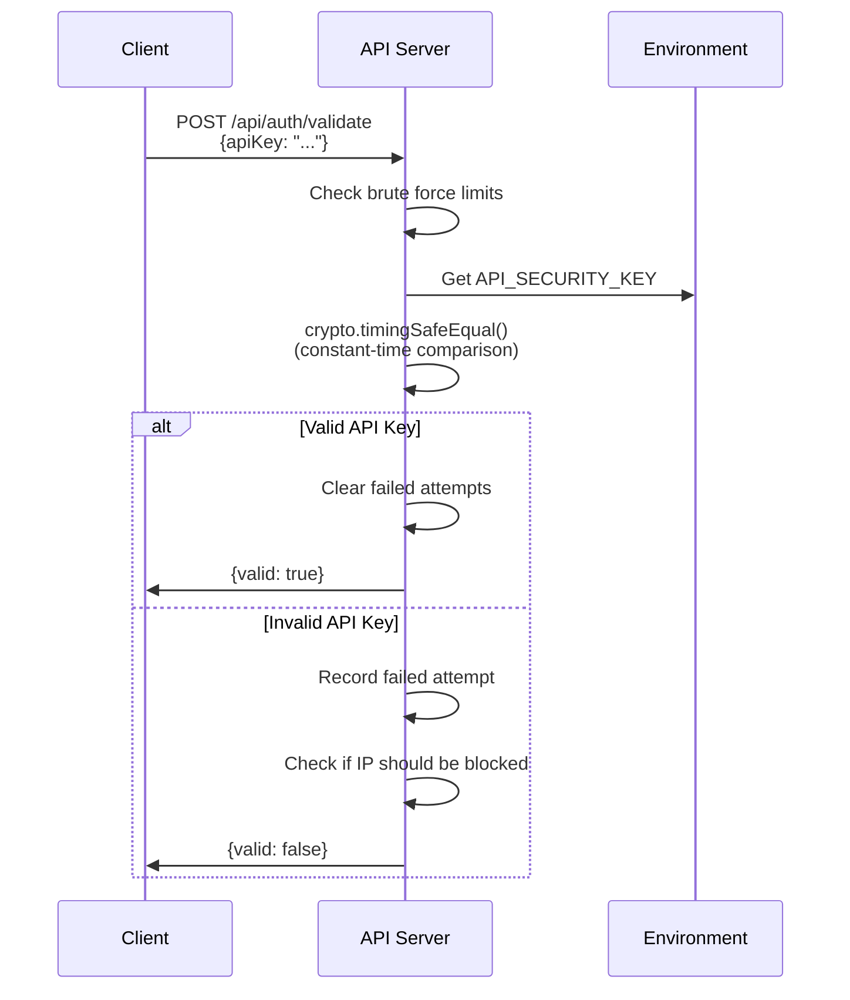

# API Authentication

My Dashboard API uses **API Key authentication** for securing endpoints. This guide explains how authentication works and how to use it.

## Authentication Method

### API Key Only (No JWT)

The API uses a simple but secure API key authentication mechanism:

- **Single API Key**: One shared secret key for all authenticated requests
- **Header-based**: API key passed via `x-api-key` header
- **Constant-time Comparison**: Prevents timing attacks
- **Brute Force Protection**: Rate limiting and IP blocking

:::warning Important
This API does **NOT** use JWT tokens. Authentication is purely API key-based.
:::

## How It Works

### Authentication Flow



### Security Features

1. **Constant-time Comparison**
   - Uses `crypto.timingSafeEqual()` to prevent timing attacks
   - Ensures comparison time is independent of input

2. **Brute Force Protection**
   - Maximum 3 failed attempts per IP within 15 minutes
   - 30-minute IP block after exceeding limit
   - Progressive slowdown in production

3. **Rate Limiting**
   - Configurable request limits per IP
   - Automatic cleanup of old attempt records

## Using Authentication

### 1. Validate API Key

Before using the API, validate your API key:

**Endpoint**: `POST /api/auth/validate`

**Request**:
```bash
curl -X POST http://localhost:3000/api/auth/validate \
  -H "Content-Type: application/json" \
  -d '{"apiKey": "your-api-key-here"}'
```

**Response (Success)**:
```json
{
  "valid": true,
  "message": "API key is valid"
}
```

**Response (Invalid)**:
```json
{
  "valid": false,
  "message": "Invalid API key"
}
```

**Response (Rate Limited)**:
```json
{
  "error": "Too many failed attempts. Try again in 25 minutes.",
  "retryAfter": 1500
}
```

### 2. Make Authenticated Requests

Include the API key in the `x-api-key` header for all subsequent requests:

**Example**:
```bash
curl http://localhost:3000/api/apps \
  -H "x-api-key: your-api-key-here"
```

**JavaScript/TypeScript**:
```typescript
const response = await fetch('http://localhost:3000/api/apps', {
  headers: {
    'x-api-key': 'your-api-key-here'
  }
});
```

**Using the SDK**:
```typescript
import { MyDashboardAPI } from '@my-dashboard/sdk';

const api = new MyDashboardAPI({
  baseUrl: 'http://localhost:3000',
  apiKey: 'your-api-key-here'
});

// SDK automatically includes the API key in all requests
const apps = await api.getApplications();
```

## Public Endpoints

The following endpoints do **NOT** require authentication:

- `GET /health` - Health check endpoint
- `POST /api/auth/validate` - API key validation

All other `/api/*` endpoints require a valid API key.

## Error Responses

### 401 Unauthorized

Missing or invalid API key:

```json
{
  "error": "Invalid or missing API key",
  "code": "UNAUTHORIZED"
}
```

### 429 Too Many Requests

Rate limit exceeded or IP blocked:

```json
{
  "error": "Too many failed attempts. Try again in 25 minutes.",
  "retryAfter": 1500
}
```

## Configuration

### Server Configuration

Set the API key in your server environment:

```bash
# server/.env
API_SECURITY_KEY=your-secret-api-key-here
```

:::tip Security Best Practice
- Use a strong, randomly generated key (at least 32 characters)
- Never commit the API key to version control
- Rotate the key periodically
- Use different keys for different environments
:::

### Brute Force Protection Settings

Configure brute force protection via environment variables:

```bash
# Maximum failed attempts before blocking (default: 3)
BRUTE_FORCE_MAX_ATTEMPTS=3

# Time window for counting attempts in milliseconds (default: 15 minutes)
BRUTE_FORCE_WINDOW_MS=900000
```

### Client Configuration

Store the API key in your client environment:

```bash
# client/.env
VITE_API_KEY=your-secret-api-key-here
```

**React Context Usage**:
```typescript
import { useAuth } from '@/contexts/useAuth';

function MyComponent() {
  const { login, isAuthenticated, apiKey } = useAuth();
  
  const handleLogin = async (key: string) => {
    const result = await login(key);
    if (result.success) {
      console.log('Logged in successfully');
    } else {
      console.error(result.error);
    }
  };
  
  return (
    // Your component JSX
  );
}
```

## Best Practices

### 1. Secure Storage

**Client-side**:
- Store API key in `localStorage` (current implementation)
- Consider using `sessionStorage` for more security
- Clear on logout

**Server-side**:
- Store in environment variables
- Never hardcode in source code
- Use secrets management in production

### 2. Key Rotation

Periodically rotate your API key:

1. Generate a new key
2. Update `API_SECURITY_KEY` in server environment
3. Update client applications
4. Monitor for failed authentication attempts

### 3. Monitoring

Monitor authentication attempts:

```typescript
// Server logs failed attempts
Logger.warn(`Failed API key validation attempt from IP: ${clientIP}`);
```

Check logs for:
- Unusual number of failed attempts
- Attempts from unexpected IPs
- Patterns indicating brute force attacks

### 4. Environment-specific Keys

Use different API keys for different environments:

```bash
# Development
API_SECURITY_KEY=dev-key-12345

# Staging
API_SECURITY_KEY=staging-key-67890

# Production
API_SECURITY_KEY=prod-key-abcdef
```

## Troubleshooting

### "Invalid or missing API key"

**Causes**:
- API key not included in request
- Wrong header name (should be `x-api-key`)
- Incorrect API key value
- API key not set in server environment

**Solutions**:
1. Verify header name is exactly `x-api-key`
2. Check API key matches server configuration
3. Ensure `API_SECURITY_KEY` is set in server `.env`

### "Too many failed attempts"

**Causes**:
- Exceeded 3 failed attempts within 15 minutes
- IP address is blocked

**Solutions**:
1. Wait 30 minutes for block to expire
2. Verify you're using the correct API key
3. Check server logs for details

### API key works locally but not in production

**Causes**:
- Different API key in production environment
- Environment variable not set correctly

**Solutions**:
1. Verify `API_SECURITY_KEY` in production environment
2. Check Railway/hosting platform environment variables
3. Restart server after updating environment variables

## Security Considerations

### Timing Attack Prevention

The API uses constant-time comparison to prevent timing attacks:

```typescript
const providedKeyBuffer = Buffer.from(apiKey, 'utf8');
const validKeyBuffer = Buffer.from(validApiKey, 'utf8');

const isLengthValid = providedKeyBuffer.length === validKeyBuffer.length;
const isContentValid = isLengthValid && 
  crypto.timingSafeEqual(providedKeyBuffer, validKeyBuffer);
```

This ensures that comparison time doesn't leak information about the correct key.

### HTTPS in Production

Always use HTTPS in production to prevent API key interception:

```
https://your-domain.com/api/apps
```

Never send API keys over unencrypted HTTP in production.

## Next Steps

- [API Overview](./overview.md) - API introduction and capabilities
- [Error Handling](./error-handling.md) - Error codes and responses
- [SDK Authentication](../sdk/authentication.md) - Using the SDK for authentication

