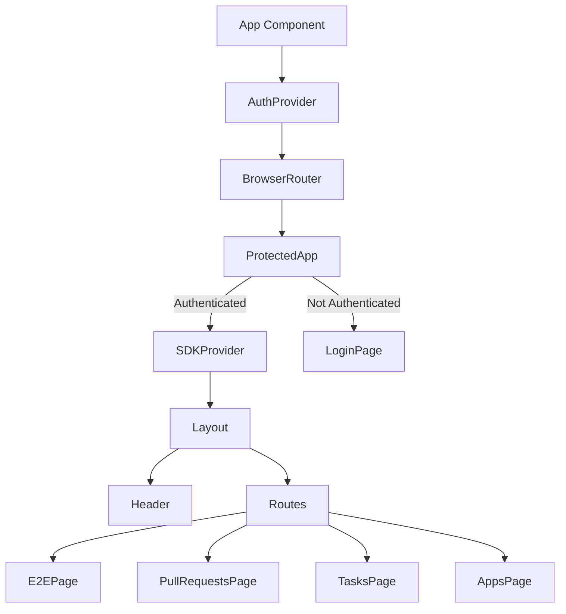

# Client Architecture

The client application is a modern React-based single-page application (SPA) built with TypeScript, Vite, and Material-UI. It provides a responsive dashboard for monitoring Cypress E2E tests, pull requests, and development tasks.

## Technology Stack

### Core Technologies
- **React 19** - Modern React with latest features
- **TypeScript 5.8.3** - Type-safe JavaScript development
- **Vite 7.1.5** - Fast build tool and development server
- **Material-UI (MUI) 7.3.1** - React component library
- **React Router DOM 7.7.1** - Client-side routing

### Key Libraries
- **SWR** - Data fetching and caching
- **Recharts** - Data visualization
- **Firebase** - Cloud Messaging for push notifications
- **Notistack** - Snackbar notifications
- **@my-dashboard/sdk** - TypeScript SDK for API communication

## Project Structure

```
client/
├── public/                 # Static assets
│   ├── logo.png           # Application logo
│   ├── logo.svg           # SVG logo
│   └── sw.js              # Service worker for PWA
├── src/
│   ├── components/        # Reusable React components
│   │   ├── common/        # Common UI components
│   │   ├── header/        # Header components
│   │   ├── layout/        # Layout components
│   │   └── navigation-drawer/ # Navigation drawer
│   ├── contexts/          # React contexts
│   │   ├── AuthContext.tsx
│   │   ├── SDKContext.tsx
│   │   ├── useAuth.ts
│   │   └── useSDK.ts
│   ├── hooks/             # Custom React hooks
│   │   └── useFCM.tsx     # Firebase Cloud Messaging
│   ├── pages/             # Page components
│   │   ├── AppsPage.tsx   # Applications dashboard
│   │   ├── E2EPage.tsx    # E2E test results
│   │   ├── LoginPage.tsx  # Authentication page
│   │   ├── PullRequestsPage.tsx # PR monitoring
│   │   └── TasksPage.tsx  # Task management
│   ├── utils/             # Utility functions
│   │   └── constants.ts   # Application constants
│   ├── App.tsx            # Main application component
│   ├── main.tsx           # Application entry point
│   └── index.css          # Global styles
├── .env.example           # Environment variables template
├── package.json           # Dependencies and scripts
├── tsconfig.json          # TypeScript configuration
└── vite.config.ts         # Vite configuration
```

## Application Architecture

### Entry Point

The application starts in `main.tsx`, which:
1. Creates the React root
2. Wraps the app in Material-UI ThemeProvider
3. Applies CssBaseline for consistent styling
4. Registers the service worker for PWA functionality

```typescript
// main.tsx
root.render(
  <StrictMode>
    <ThemeProvider theme={theme} defaultMode="system">
      <CssBaseline />
      <App />
    </ThemeProvider>
  </StrictMode>
);
```

### App Component Structure

The `App.tsx` component sets up the application structure:



### Authentication Flow

The authentication system uses React Context for state management:

1. **AuthProvider** (`AuthContext.tsx`):
   - Manages authentication state
   - Stores API key in localStorage
   - Validates API key with server
   - Provides login/logout functions

2. **Protected Routes**:
   - Checks authentication status
   - Shows loading spinner during validation
   - Redirects to login if not authenticated
   - Renders protected content when authenticated

```typescript
// Authentication flow
const ProtectedApp: React.FC = () => {
  const { isAuthenticated, isLoading } = useAuth();

  if (isLoading) return <CircularProgress />;
  if (!isAuthenticated) return <LoginPage />;
  
  return <SDKProvider>...</SDKProvider>;
};
```

### State Management

The application uses multiple state management strategies:

#### 1. React Context
- **AuthContext**: Authentication state and API key
- **SDKContext**: SDK instance and readiness state

#### 2. SWR (Stale-While-Revalidate)
- Server state management
- Automatic caching and revalidation
- Real-time data updates
- Error handling and retry logic

#### 3. Local State
- Component-specific state with `useState`
- Form state management
- UI state (modals, drawers, etc.)

### Routing Structure

```
/                    # Home page (Tasks)
/e2e-dashboard       # E2E test results dashboard
/pull_requests       # Pull request monitoring
/apps                # Application monitoring
```

Routes are lazy-loaded for better performance:

```typescript
const E2EPage = lazy(() => import('@/pages/E2EPage.tsx'));
const PullRequestsPage = lazy(() => import('./pages/PullRequestsPage.tsx'));
const TasksPage = lazy(() => import('./pages/TasksPage.tsx'));
const AppsPage = lazy(() => import('./pages/AppsPage.tsx'));
```

### Component Architecture

#### Layout Components

**Header** (`components/header/Header.tsx`):
- Logo and branding
- Navigation links
- Notification bell with badge
- Theme switcher
- Logout button
- Mobile menu toggle

**Layout** (`components/layout/Layout.tsx`):
- Main application layout
- Header positioning
- Content area with proper spacing
- Responsive design

**NavigationDrawer**:
- Mobile navigation menu
- Slide-in drawer
- Navigation links
- Logout option

#### Page Components

Each page component follows a consistent structure:
1. Data fetching with SWR
2. Loading states
3. Error handling
4. Main content rendering
5. Action buttons/forms

Example structure:
```typescript
const E2EPage = () => {
  const { api } = useSDK();
  const { data, error, isLoading } = useSWR('e2e-reports', () => 
    api?.e2e.getReports()
  );

  if (isLoading) return <CircularProgress />;
  if (error) return <ErrorMessage />;
  
  return <E2EDashboard data={data} />;
};
```

### SDK Integration

The application uses the `@my-dashboard/sdk` package for API communication:

**SDKProvider** (`contexts/SDKContext.tsx`):
- Initializes SDK with API key
- Provides SDK instance to components
- Handles SDK errors
- Manages SDK readiness state

```typescript
const api = useMemo(() => {
  if (!isAuthenticated || !apiKey) return null;
  
  return new MyDashboardAPI({
    baseUrl: API_BASE_URL,
    apiKey: apiKey,
    retries: 3,
    timeout: 30000,
  });
}, [apiKey, isAuthenticated]);
```

**Usage in Components**:
```typescript
const { api, isReady } = useSDK();

// Fetch data
const data = await api.e2e.getReports();
const apps = await api.applications.getAll();
```

### Firebase Cloud Messaging

Push notifications are handled through Firebase:

**Setup** (`firebase-config.ts`):
- Initialize Firebase app
- Configure messaging
- Request notification permissions

**useFCM Hook** (`hooks/useFCM.tsx`):
- Request notification permission
- Get FCM token
- Register token with server
- Handle foreground messages
- Show notifications

### Material-UI Theme

The application uses a custom Material-UI theme:

**Theme Configuration**:
- Light/Dark mode support
- System preference detection
- Custom color palette
- Responsive breakpoints
- Typography settings

```typescript
const theme = createTheme({
  palette: {
    background: {
      default: '#e9e9e9',
      paper: '#ffffff',
    },
  },
  colorSchemes: {
    light: { /* light theme */ },
    dark: { /* dark theme */ },
  },
});
```

**Theme Switcher**:
- Toggle between light/dark/system modes
- Persistent preference storage
- Smooth transitions

### Performance Optimizations

1. **Code Splitting**:
   - Lazy loading of page components
   - Dynamic imports for heavy components
   - Reduced initial bundle size

2. **Memoization**:
   - `useMemo` for expensive computations
   - `useCallback` for event handlers
   - React.memo for pure components

3. **SWR Caching**:
   - Automatic request deduplication
   - Cache-first strategy
   - Background revalidation

4. **Service Worker**:
   - PWA functionality
   - Offline support
   - Asset caching

### Build Configuration

**Vite Configuration** (`vite.config.ts`):
- Path aliases (`@/` for `src/`)
- Environment variable handling
- Build optimizations
- Development server settings

**TypeScript Configuration** (`tsconfig.json`):
- Strict type checking
- Path mapping
- JSX configuration
- Module resolution

## Key Features

### 1. E2E Test Dashboard
- Real-time test execution monitoring
- Test result visualization with charts
- Historical test data and trends
- Failed test analysis

### 2. Pull Request Monitoring
- GitHub PR integration
- PR status tracking
- Review status indicators
- Merge readiness checks

### 3. Task Management
- To-do list functionality
- Task creation and editing
- Due date tracking
- Completion status

### 4. Application Monitoring
- Multiple project tracking
- Application health status
- E2E test configuration
- Pipeline integration

### 5. Real-time Notifications
- Push notifications via FCM
- In-app notification center
- Notification badges
- Read/unread status

## Security Features

### Authentication
- API key-based authentication
- Secure key storage in localStorage
- Server-side validation
- Automatic session management

### API Communication
- HTTPS only in production
- API key in request headers
- Request/response validation
- Error handling

### Content Security
- CSP headers
- XSS protection
- Secure dependencies
- Regular security updates

## Development Workflow

### Local Development
```bash
npm run dev        # Start development server
npm run build      # Build for production
npm run preview    # Preview production build
npm run lint       # Run ESLint
npm run lint-fix   # Fix ESLint issues
```

### Environment Variables
```env
VITE_API_BASE_URL=http://localhost:3000
VITE_FIREBASE_API_KEY=your-api-key
VITE_FIREBASE_PROJECT_ID=your-project-id
# ... other Firebase config
```

## Next Steps

- [Server Architecture](./server-architecture.md) - Backend architecture details
- [Database Schema](./database-schema.md) - Database design
- [Development Setup](../development/setup.md) - Development environment

