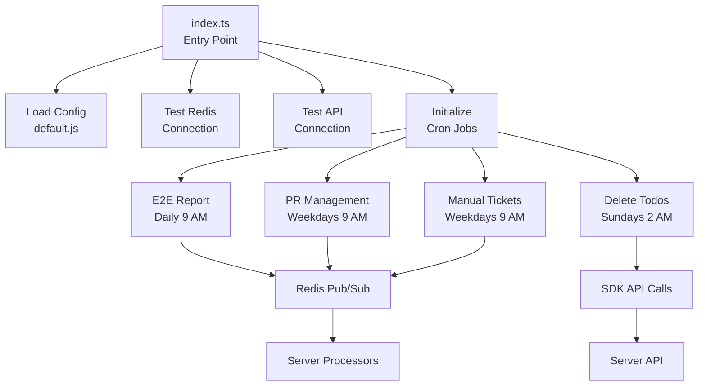
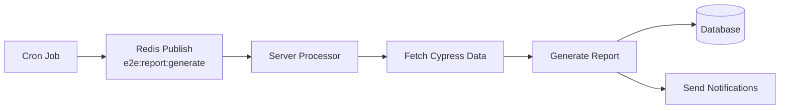
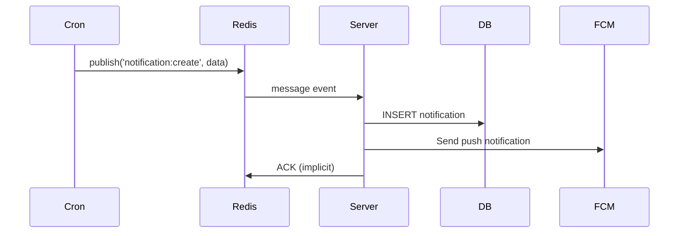

# Cron Architecture

The cron application is a Node.js service that runs scheduled background jobs for the My Dashboard application. It handles automated tasks like E2E report generation, pull request management, manual testing reminders, and data cleanup operations using a Redis pub/sub architecture for asynchronous communication with the server.

## Technology Stack

### Core Technologies
- **Node.js v22.20.0** - JavaScript runtime environment
- **TypeScript 5.1.6** - Type-safe JavaScript development
- **node-cron 4.2.1** - Cron job scheduling
- **ioredis 5.4.2** - Redis client for pub/sub messaging
- **config 3.3.9** - Configuration management

### Key Libraries
- **@my-dashboard/sdk** - TypeScript SDK for API communication
- **@my-dashboard/types** - Shared type definitions
- **dotenv 17.2.2** - Environment variable management
- **ts-node 10.9.1** - TypeScript execution for development

## Project Structure

```
cron/
├── src/
│   ├── jobs/              # Scheduled job implementations
│   │   ├── report-e2e.job.ts
│   │   ├── pull-requests-management.job.ts
│   │   ├── manualTicketsReminder.job.ts
│   │   └── delete-completed-todos.job.ts
│   ├── services/          # Business logic services
│   │   ├── notification.service.ts
│   │   └── pull-request.service.ts
│   ├── utils/             # Utility functions
│   │   ├── redis.ts       # Redis connection management
│   │   ├── sdk.ts         # SDK instance management
│   │   ├── constants.ts   # Application constants
│   │   └── helpers.ts     # Helper functions
│   └── index.ts           # Application entry point
├── config/                # Configuration files
│   └── default.js         # Default job schedules
├── tests/                 # Unit tests
├── dist/                  # Compiled JavaScript (generated)
├── .env.example           # Environment variables template
├── package.json           # Dependencies and scripts
├── tsconfig.json          # TypeScript configuration
└── railway.toml           # Railway deployment config
```

## Application Architecture

### Entry Point

The application starts in `index.ts`, which:
1. Loads environment variables
2. Tests Redis connection
3. Validates SDK connectivity
4. Initializes and schedules all cron jobs
5. Keeps the process running

```typescript
// index.ts
async function main() {
  // Test Redis connection
  const redisConnected = await testRedisConnection();
  if (!redisConnected) {
    console.error('Failed to connect to Redis');
    process.exit(1);
  }

  // Test API connection
  await healthCheckAPI();

  // Initialize cron jobs
  initializeCronJobs();

  console.log('Cron service is running...');
}
```

### Job Scheduling Architecture



### Configuration Management

Job schedules are managed through the `config` library:

```javascript
// config/default.js
module.exports = {
  jobs: {
    report_e2e: {
      schedule: process.env.E2E_REPORT_CRON_SCHEDULE || '0 9 * * *',
    },
    pull_requests_management: {
      schedule: process.env.PR_MANAGEMENT_SCHEDULE || '0 9 * * 1-5',
    },
    manual_tickets_reminder: {
      schedule: process.env.MANUAL_TICKETS_REMINDER_SCHEDULE || '0 9 * * 1-5',
    },
    delete_completed_todos: {
      schedule: process.env.DELETE_COMPLETED_TODOS_SCHEDULE || '0 2 * * 0',
    },
  },
};
```

**Cron Schedule Format**: `* * * * *`
- Minute (0-59)
- Hour (0-23)
- Day of Month (1-31)
- Month (1-12)
- Day of Week (0-7, 0 and 7 are Sunday)

## Scheduled Jobs

### 1. E2E Report Generation

**File**: `jobs/report-e2e.job.ts`  
**Schedule**: `0 9 * * *` (Daily at 9 AM)  
**Environment Variable**: `E2E_REPORT_CRON_SCHEDULE`

**Purpose**: Triggers E2E test report generation via Redis pub/sub

**Flow**:


**Implementation**:
```typescript
const runReportE2EJob = async (): Promise<void> => {
  const client = getRedisClient();
  
  await client.publish('e2e:report:generate', JSON.stringify({
    date: new Date().toISOString(),
    requestId: crypto.randomUUID(),
  }));
  
  console.log('E2E report generation request published');
};
```

### 2. Pull Requests Management

**File**: `jobs/pull-requests-management.job.ts`  
**Schedule**: `0 9 * * 1-5` (Weekdays at 9 AM)  
**Environment Variable**: `PR_MANAGEMENT_SCHEDULE`

**Purpose**: Unified job that handles all PR-related operations

**Operations**:
1. **Check for PRs ready to merge** - Identifies approved PRs
2. **Send reminders for old PRs** - Alerts for PRs 3+ and 7+ days old
3. **Delete merged PRs** - Cleans up merged PRs from database

**Flow**:
```typescript
async function pullRequestsManagementJob() {
  // Fetch all PRs once (reduces API calls)
  const { allPRs } = await PullRequestService.fetchAllPRsWithDetails();
  
  // Categorize PRs
  const openNonMergedPRs = allPRs.filter(pr => 
    pr.state === 'open' && !pr.merged
  );
  const mergedPRs = allPRs.filter(pr => pr.merged);
  
  // Operation 1: Check for ready-to-merge PRs
  await checkReadyToMergePRs(openNonMergedPRs);
  
  // Operation 2: Send reminders for old PRs
  await checkOldPullRequests(openNonMergedPRs);
  
  // Operation 3: Delete merged PRs
  await deleteMergedPullRequests(mergedPRs);
}
```

**Optimization**: By fetching all PRs once, this unified job reduces API calls from 3 separate jobs to 1.

### 3. Manual Testing Reminders

**File**: `jobs/manualTicketsReminder.job.ts`  
**Schedule**: `0 9 * * 1-5` (Weekdays at 9 AM)  
**Environment Variable**: `MANUAL_TICKETS_REMINDER_SCHEDULE`

**Purpose**: Sends reminders for manual testing tasks from JIRA

**Implementation**:
```typescript
const manualTicketsReminderJob = async () => {
  const sdk = await getSDK();
  const { issues } = await sdk.jira.getManualQATasks();

  if (issues.length > 0) {
    await publishNotificationRequest({
      title: 'Manual Testing Tickets - Reminder',
      message: `There ${issues.length > 1 ? 'are' : 'is'} ${issues.length} ticket${issues.length > 1 ? 's' : ''} that need${issues.length > 1 ? '' : 's'} attention.`,
      type: 'warning',
      link: '/',
    });
  }
};
```

### 4. Delete Completed Todos

**File**: `jobs/delete-completed-todos.job.ts`  
**Schedule**: `0 2 * * 0` (Sundays at 2 AM)  
**Environment Variable**: `DELETE_COMPLETED_TODOS_SCHEDULE`

**Purpose**: Cleans up completed to-do items from the database

**Implementation**:
```typescript
const deleteCompletedTodosJob = async (): Promise<void> => {
  const sdk = await getSDK();
  const todos = await sdk.todos.getTodos();
  
  const completedTodos = todos.filter(todo => todo.isCompleted);
  
  for (const todo of completedTodos) {
    if (todo.id) {
      await sdk.todos.deleteTodo(todo.id);
    }
  }
};
```

## Services Layer

### Notification Service

**File**: `services/notification.service.ts`

Handles publishing notification requests to Redis:

```typescript
export async function publishNotificationRequest(
  notification: NotificationInput,
): Promise<void> {
  const client = getRedisClient();
  
  await client.publish('notification:create', JSON.stringify(notification));
  console.log(`Published notification: ${notification.title}`);
}
```

**Notification Types**:
- `info` - Informational messages
- `warning` - Warning messages
- `error` - Error messages
- `success` - Success messages

### Pull Request Service

**File**: `services/pull-request.service.ts`

Centralized service for PR operations:

```typescript
export class PullRequestService {
  // Fetch all PRs with GitHub details
  static async fetchAllPRsWithDetails(): Promise<FetchAllPRsResult>
  
  // Filter PRs by state
  static filterByState(prs: PRWithDetails[], state: 'open' | 'closed')
  
  // Filter PRs by merged status
  static filterByMerged(prs: PRWithDetails[], merged: boolean)
  
  // Filter PRs by mergeable state
  static filterByMergeableState(prs: PRWithDetails[], states: string[])
  
  // Calculate PR age in days
  static calculateAgeInDays(createdAt: string): number
}
```

**Benefits**:
- Reduces code duplication
- Centralizes PR logic
- Minimizes API calls
- Provides consistent filtering

## Redis Pub/Sub Architecture

### Redis Connection Management

**File**: `utils/redis.ts`

```typescript
// Get Redis client for publishing
export function getRedisClient(): Redis {
  if (!redisClient) {
    redisClient = createRedisInstance('client');
  }
  return redisClient;
}

// Get Redis subscriber for receiving messages
export function getRedisSubscriber(): Redis {
  if (!redisSubscriber) {
    redisSubscriber = createRedisInstance('subscriber');
  }
  return redisSubscriber;
}
```

### Pub/Sub Channels

| Channel | Publisher | Subscriber | Purpose |
|---------|-----------|------------|---------|
| `e2e:report:generate` | Cron | Server | Trigger E2E report generation |
| `notification:create` | Cron | Server | Create notifications from background jobs |
| `pr:delete` | Cron | Server | Delete pull request from database |

### Message Flow



## SDK Integration

### SDK Instance Management

**File**: `utils/sdk.ts`

```typescript
export async function getSDK(): Promise<MyDashboardAPI> {
  if (sdkInstance) {
    return sdkInstance;
  }

  const { MyDashboardAPI } = await import('@my-dashboard/sdk');
  
  sdkInstance = new MyDashboardAPI({
    baseUrl: process.env.API_URL || 'http://localhost:3000',
    apiKey: process.env.API_SECURITY_KEY,
    retries: 3,
    timeout: 30000,
  });

  return sdkInstance;
}
```

**Features**:
- Singleton pattern for efficiency
- Lazy loading
- Automatic retry logic
- Configurable timeout

### SDK Usage in Jobs

```typescript
// Example: Using SDK in a job
const myJob = async () => {
  const sdk = await getSDK();
  
  // Fetch data
  const pullRequests = await sdk.pullRequests.getPullRequests();
  const todos = await sdk.todos.getTodos();
  const jiraTickets = await sdk.jira.getManualQATasks();
  
  // Process data...
};
```

## Error Handling

### Job-Level Error Handling

Each job implements comprehensive error handling:

```typescript
const myJob = async (): Promise<void> => {
  try {
    console.log('='.repeat(60));
    console.log('Running My Job...');
    console.log('='.repeat(60));
    
    // Job logic here
    
    console.log('✓ Job completed successfully');
  } catch (error) {
    console.error('❌ Error running job:', error);
    // Job continues running on next schedule
  }
};
```

### Connection Error Handling

```typescript
// Redis connection with retry strategy
const retryStrategy = (times: number): number => 
  Math.min(times * 50, 2000);

// SDK with automatic retries
const sdk = new MyDashboardAPI({
  retries: 3,
  timeout: 30000,
});
```

## Next Steps

- [Server Architecture](./server-architecture.md) - Backend architecture and processors
- [Client Architecture](./client-architecture.md) - Frontend architecture
- [Database Schema](./database-schema.md) - Database design
- [Development Setup](../development/setup.md) - Development environment

