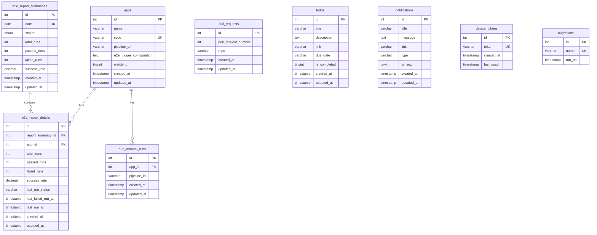

# Database Schema

The My Dashboard application uses MySQL 8.0 as its primary database. The schema is designed to support E2E test reporting, pull request tracking, JIRA integration, task management, and push notifications.

## Database Configuration

- **Database**: MySQL 8.0
- **Charset**: utf8mb4
- **Collation**: utf8mb4_unicode_ci
- **Timezone**: UTC (+00:00)
- **Engine**: InnoDB

## Schema Overview



## Table Definitions

### 1. apps

Stores application/project information for E2E test monitoring.

```sql
CREATE TABLE IF NOT EXISTS apps (
    id INT AUTO_INCREMENT PRIMARY KEY,
    name VARCHAR(255) NOT NULL,
    code VARCHAR(100) NOT NULL UNIQUE,
    pipeline_url VARCHAR(500),
    e2e_trigger_configuration TEXT,
    watching TINYINT(1) DEFAULT 0,
    created_at TIMESTAMP DEFAULT CURRENT_TIMESTAMP,
    updated_at TIMESTAMP DEFAULT CURRENT_TIMESTAMP ON UPDATE CURRENT_TIMESTAMP
) ENGINE=InnoDB DEFAULT CHARSET=utf8mb4 COLLATE=utf8mb4_unicode_ci;
```

**Columns:**
- `id` - Primary key
- `name` - Application display name
- `code` - Unique application code/identifier
- `pipeline_url` - CI/CD pipeline URL
- `e2e_trigger_configuration` - JSON configuration for triggering E2E tests
- `watching` - Whether the app is actively monitored (0 or 1)
- `created_at` - Record creation timestamp
- `updated_at` - Last update timestamp

**Indexes:**
- PRIMARY KEY on `id`
- UNIQUE KEY on `code`

### 2. pull_requests

Tracks GitHub pull requests for monitoring and notifications.

```sql
CREATE TABLE IF NOT EXISTS pull_requests (
    id INT AUTO_INCREMENT PRIMARY KEY,
    pull_request_number INT NOT NULL,
    repo VARCHAR(255) NOT NULL,
    created_at TIMESTAMP DEFAULT CURRENT_TIMESTAMP,
    updated_at TIMESTAMP DEFAULT CURRENT_TIMESTAMP ON UPDATE CURRENT_TIMESTAMP
) ENGINE=InnoDB DEFAULT CHARSET=utf8mb4 COLLATE=utf8mb4_unicode_ci;
```

**Columns:**
- `id` - Primary key
- `pull_request_number` - GitHub PR number
- `repo` - Repository name (format: owner/repo)
- `created_at` - Record creation timestamp
- `updated_at` - Last update timestamp

**Indexes:**
- PRIMARY KEY on `id`

### 3. todos

Stores to-do list items for task management.

```sql
CREATE TABLE IF NOT EXISTS todos (
    id INT AUTO_INCREMENT PRIMARY KEY,
    title VARCHAR(255) NOT NULL,
    description TEXT,
    link VARCHAR(500),
    due_date VARCHAR(50),
    is_completed TINYINT(1) DEFAULT 0,
    created_at TIMESTAMP DEFAULT CURRENT_TIMESTAMP,
    updated_at TIMESTAMP DEFAULT CURRENT_TIMESTAMP ON UPDATE CURRENT_TIMESTAMP
) ENGINE=InnoDB DEFAULT CHARSET=utf8mb4 COLLATE=utf8mb4_unicode_ci;
```

**Columns:**
- `id` - Primary key
- `title` - Task title
- `description` - Detailed task description
- `link` - Related URL (JIRA ticket, PR, etc.)
- `due_date` - Due date (ISO string format)
- `is_completed` - Completion status (0 or 1)
- `created_at` - Record creation timestamp
- `updated_at` - Last update timestamp

**Indexes:**
- PRIMARY KEY on `id`

### 4. notifications

Stores in-app notifications and push notification history.

```sql
CREATE TABLE IF NOT EXISTS notifications (
    id INT AUTO_INCREMENT PRIMARY KEY,
    title VARCHAR(255),
    message TEXT NOT NULL,
    link VARCHAR(500),
    type VARCHAR(50) NOT NULL,
    is_read TINYINT(1) DEFAULT 0,
    created_at TIMESTAMP DEFAULT CURRENT_TIMESTAMP,
    updated_at TIMESTAMP DEFAULT CURRENT_TIMESTAMP ON UPDATE CURRENT_TIMESTAMP
) ENGINE=InnoDB DEFAULT CHARSET=utf8mb4 COLLATE=utf8mb4_unicode_ci;
```

**Columns:**
- `id` - Primary key
- `title` - Notification title
- `message` - Notification message body
- `link` - Related URL for action
- `type` - Notification type (e2e_report, pr_reminder, etc.)
- `is_read` - Read status (0 or 1)
- `created_at` - Record creation timestamp
- `updated_at` - Last update timestamp

**Indexes:**
- PRIMARY KEY on `id`

### 5. device_tokens

Stores Firebase Cloud Messaging device tokens for push notifications.

```sql
CREATE TABLE IF NOT EXISTS device_tokens (
    id INT AUTO_INCREMENT PRIMARY KEY,
    token VARCHAR(255) NOT NULL UNIQUE,
    created_at TIMESTAMP DEFAULT CURRENT_TIMESTAMP,
    last_used TIMESTAMP DEFAULT CURRENT_TIMESTAMP ON UPDATE CURRENT_TIMESTAMP
) ENGINE=InnoDB DEFAULT CHARSET=utf8mb4 COLLATE=utf8mb4_unicode_ci;
```

**Columns:**
- `id` - Primary key
- `token` - FCM device token (unique)
- `created_at` - Token registration timestamp
- `last_used` - Last time token was used

**Indexes:**
- PRIMARY KEY on `id`
- UNIQUE KEY on `token`

### 6. e2e_report_summaries

Stores daily E2E test report summaries.

```sql
CREATE TABLE IF NOT EXISTS e2e_report_summaries (
    id INT AUTO_INCREMENT PRIMARY KEY,
    date DATE NOT NULL UNIQUE COMMENT 'Report date in YYYY-MM-DD format (UTC)',
    status ENUM('ready', 'pending', 'failed') NOT NULL DEFAULT 'pending',
    total_runs INT NOT NULL DEFAULT 0,
    passed_runs INT NOT NULL DEFAULT 0,
    failed_runs INT NOT NULL DEFAULT 0,
    success_rate DECIMAL(5, 4) NOT NULL DEFAULT 0.0000 COMMENT 'Value between 0 and 1',
    created_at TIMESTAMP DEFAULT CURRENT_TIMESTAMP,
    updated_at TIMESTAMP DEFAULT CURRENT_TIMESTAMP ON UPDATE CURRENT_TIMESTAMP,
    INDEX idx_date (date),
    INDEX idx_status (status)
) ENGINE=InnoDB DEFAULT CHARSET=utf8mb4 COLLATE=utf8mb4_unicode_ci;
```

**Columns:**
- `id` - Primary key
- `date` - Report date (YYYY-MM-DD format, UTC)
- `status` - Report generation status (ready, pending, failed)
- `total_runs` - Total number of test runs
- `passed_runs` - Number of passed runs
- `failed_runs` - Number of failed runs
- `success_rate` - Success rate (0.0000 to 1.0000)
- `created_at` - Record creation timestamp
- `updated_at` - Last update timestamp

**Indexes:**
- PRIMARY KEY on `id`
- UNIQUE KEY on `date`
- INDEX on `date`
- INDEX on `status`

### 7. e2e_report_details

Stores per-application E2E test details for each report.

```sql
CREATE TABLE IF NOT EXISTS e2e_report_details (
    id INT AUTO_INCREMENT PRIMARY KEY,
    report_summary_id INT NOT NULL,
    app_id INT NOT NULL,
    total_runs INT NOT NULL DEFAULT 0,
    passed_runs INT NOT NULL DEFAULT 0,
    failed_runs INT NOT NULL DEFAULT 0,
    success_rate DECIMAL(5, 4) NOT NULL DEFAULT 0.0000 COMMENT 'Value between 0 and 1',
    last_run_status VARCHAR(50) NOT NULL,
    last_failed_run_at TIMESTAMP NULL DEFAULT NULL COMMENT 'ISO date string or null',
    last_run_at TIMESTAMP NOT NULL,
    created_at TIMESTAMP DEFAULT CURRENT_TIMESTAMP,
    updated_at TIMESTAMP DEFAULT CURRENT_TIMESTAMP ON UPDATE CURRENT_TIMESTAMP,
    FOREIGN KEY (report_summary_id) REFERENCES e2e_report_summaries(id) ON DELETE CASCADE,
    FOREIGN KEY (app_id) REFERENCES apps(id) ON DELETE CASCADE,
    INDEX idx_report_summary_id (report_summary_id),
    INDEX idx_app_id (app_id)
) ENGINE=InnoDB DEFAULT CHARSET=utf8mb4 COLLATE=utf8mb4_unicode_ci;
```

**Columns:**
- `id` - Primary key
- `report_summary_id` - Foreign key to e2e_report_summaries
- `app_id` - Foreign key to apps
- `total_runs` - Total runs for this app
- `passed_runs` - Passed runs for this app
- `failed_runs` - Failed runs for this app
- `success_rate` - Success rate for this app (0.0000 to 1.0000)
- `last_run_status` - Status of last run (passed, failed, etc.)
- `last_failed_run_at` - Timestamp of last failed run (nullable)
- `last_run_at` - Timestamp of last run
- `created_at` - Record creation timestamp
- `updated_at` - Last update timestamp

**Indexes:**
- PRIMARY KEY on `id`
- FOREIGN KEY on `report_summary_id` → `e2e_report_summaries(id)`
- FOREIGN KEY on `app_id` → `apps(id)`
- INDEX on `report_summary_id`
- INDEX on `app_id`

### 8. e2e_manual_runs

Tracks manually triggered E2E test runs.

```sql
CREATE TABLE IF NOT EXISTS e2e_manual_runs (
    id INT AUTO_INCREMENT PRIMARY KEY,
    app_id INT NOT NULL,
    pipeline_id VARCHAR(255) NOT NULL,
    created_at TIMESTAMP DEFAULT CURRENT_TIMESTAMP,
    updated_at TIMESTAMP DEFAULT CURRENT_TIMESTAMP ON UPDATE CURRENT_TIMESTAMP,
    FOREIGN KEY (app_id) REFERENCES apps(id) ON DELETE CASCADE,
    INDEX idx_app_id (app_id),
    INDEX idx_pipeline_id (pipeline_id)
) ENGINE=InnoDB DEFAULT CHARSET=utf8mb4 COLLATE=utf8mb4_unicode_ci;
```

**Columns:**
- `id` - Primary key
- `app_id` - Foreign key to apps
- `pipeline_id` - CI/CD pipeline run ID
- `created_at` - Record creation timestamp
- `updated_at` - Last update timestamp

**Indexes:**
- PRIMARY KEY on `id`
- FOREIGN KEY on `app_id` → `apps(id)`
- INDEX on `app_id`
- INDEX on `pipeline_id`

### 9. migrations

Tracks applied database migrations.

```sql
CREATE TABLE IF NOT EXISTS migrations (
    id INT AUTO_INCREMENT PRIMARY KEY,
    name VARCHAR(255) NOT NULL UNIQUE,
    run_on TIMESTAMP DEFAULT CURRENT_TIMESTAMP
) ENGINE=InnoDB DEFAULT CHARSET=utf8mb4 COLLATE=utf8mb4_unicode_ci;
```

**Columns:**
- `id` - Primary key
- `name` - Migration file name
- `run_on` - Migration execution timestamp

**Indexes:**
- PRIMARY KEY on `id`
- UNIQUE KEY on `name`

## Migration System

### Migration Files

Migrations are stored in `server/migrations/mysql/` with the naming convention:
```
YYYYMMDDHHMMSS_description.sql
```

Example:
```
001_create_pull_requests_table.sql
002_create_todos_table.sql
003_create_notifications_table.sql
```

### Running Migrations

```bash
cd server
npm run migrate
```

The migration runner:
1. Creates the `migrations` table if it doesn't exist
2. Reads all `.sql` files from the migrations directory
3. Checks which migrations have already been applied
4. Executes pending migrations in order
5. Records each migration in the `migrations` table

## Next Steps

- [Server Architecture](./server-architecture.md) - Backend architecture
- [Deployment](./deployment.md) - Deployment process
- [Development Setup](../development/setup.md) - Local development

