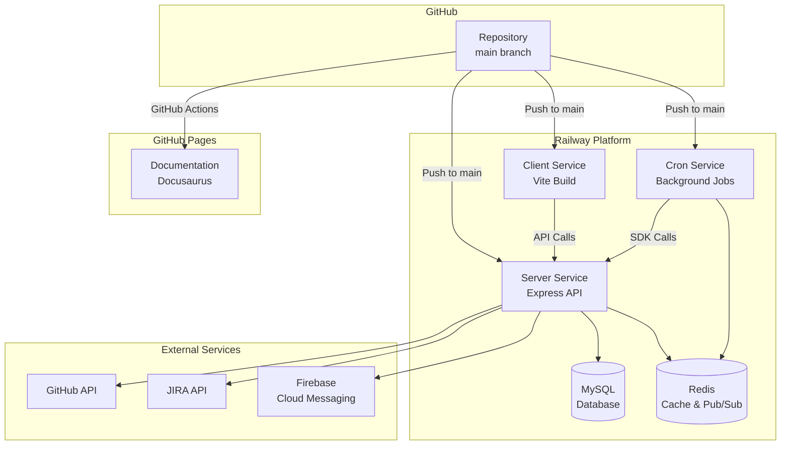
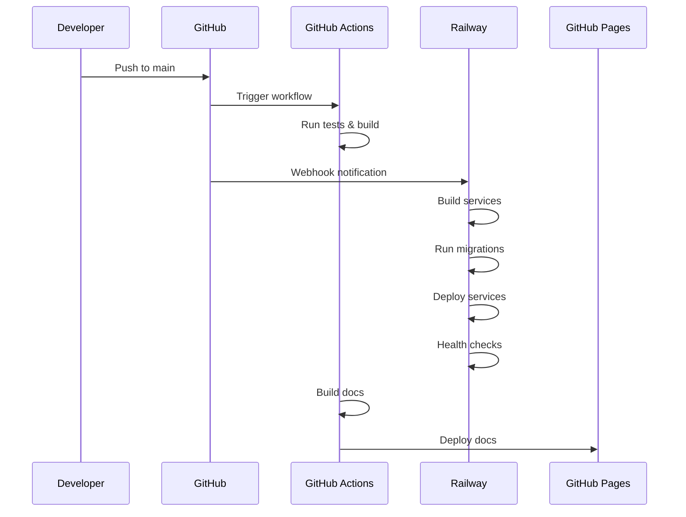

# Deployment Architecture

My Dashboard is deployed on Railway with automated CI/CD through GitHub Actions. The application consists of three main services: Client, Server, and Cron, all deployed as separate Railway services.

## Deployment Platform

### Railway

**Why Railway?**
- Simple deployment process
- Automatic HTTPS
- Built-in MySQL database
- Redis support
- Environment variable management
- Auto-deploy from GitHub
- Health check monitoring
- Logs and metrics

## Architecture Overview



## Services

### 1. Client Service

**Build Process:**
```bash
# Install dependencies
pnpm install --filter=client

# Build for production
cd client
npm run build
```

**Deployment:**
- Static files served from `client/dist`
- Vite production build
- Environment variables injected at build time
- Automatic HTTPS
- CDN caching

**Environment Variables:**
```env
VITE_API_BASE_URL=https://api.mydashboard.com
VITE_FIREBASE_API_KEY=...
VITE_FIREBASE_PROJECT_ID=...
VITE_FIREBASE_MESSAGING_SENDER_ID=...
VITE_FIREBASE_APP_ID=...
```

### 2. Server Service

**Build Process:**
```bash
# Install dependencies
pnpm install --filter=server

# Build TypeScript
cd server
npm run build

# Run migrations
npm run migrate

# Start server
npm start
```

**Deployment:**
- Node.js application
- Express.js server
- MySQL database connection
- Redis connection
- Health check endpoint: `/health`

**Environment Variables:**
```env
NODE_ENV=production
PORT=3000
API_SECURITY_KEY=...

# MySQL Configuration
MYSQL_HOST=...
MYSQL_PORT=3306
MYSQL_USER=...
MYSQL_PASSWORD=...
MYSQL_DATABASE=...
MYSQL_CONNECTION_LIMIT=10

# Redis Configuration
REDIS_URL=redis://...

# GitHub Integration
GITHUB_TOKEN=...
GITHUB_REPOS=owner/repo1,owner/repo2

# JIRA Integration
JIRA_BASE_URL=...
JIRA_EMAIL=...
JIRA_API_TOKEN=...

# Firebase Configuration
FIREBASE_PROJECT_ID=...
FIREBASE_PRIVATE_KEY=...
FIREBASE_CLIENT_EMAIL=...
```

### 3. Cron Service

**Build Process:**
```bash
# Install dependencies
pnpm install --filter=cron

# Build TypeScript
cd cron
npm run build

# Start cron jobs
npm start
```

**Deployment:**
- Node.js application
- node-cron scheduler
- Redis Pub/Sub publisher
- SDK client for API calls

**Environment Variables:**
```env
NODE_ENV=production
API_BASE_URL=https://api.mydashboard.com
API_SECURITY_KEY=...

# Redis Configuration
REDIS_URL=redis://...

# Cron Schedules (optional overrides)
E2E_REPORT_CRON_SCHEDULE=0 9 * * *
PR_MANAGEMENT_SCHEDULE=0 9 * * 1-5
MANUAL_TICKETS_REMINDER_SCHEDULE=0 9 * * 1-5
DELETE_COMPLETED_TODOS_SCHEDULE=0 2 * * 0

# GitHub Integration
GITHUB_TOKEN=...

# JIRA Integration
JIRA_BASE_URL=...
JIRA_EMAIL=...
JIRA_API_TOKEN=...
```

### 4. MySQL Database

**Configuration:**
- MySQL 8.0
- Automatic backups
- Connection pooling
- UTF8MB4 charset
- UTC timezone

**Migrations:**
- Run automatically on server deployment
- Located in `server/migrations/mysql/`
- Tracked in `migrations` table

### 5. Redis

**Configuration:**
- Redis 7.x
- Pub/Sub messaging
- Future: Caching, session storage

**Channels:**
- `e2e:report:generate`
- `notification:create`
- `pr:delete`

## CI/CD Pipeline

### GitHub Actions Workflow

**Trigger:** Push to `main` branch

**Jobs:**

1. **Build and Test**
   ```yaml
   - Checkout code
   - Setup Node.js
   - Install pnpm
   - Install dependencies
   - Run linting
   - Run tests (if available)
   - Build all packages
   ```

2. **Deploy to Railway**
   - Automatic deployment via Railway GitHub integration
   - Railway detects changes and rebuilds services
   - Health checks verify deployment

3. **Deploy Documentation**
   ```yaml
   - Build Docusaurus site
   - Deploy to GitHub Pages
   ```

### Deployment Flow



## Health Checks

### Server Health Check

**Endpoint:** `GET /health`

**Response:**
```json
{
  "success": true,
  "status": "ok",
  "service": "My Dashboard Server",
  "dbConnected": true,
  "timestamp": "2024-01-20T10:00:00.000Z",
  "uptime": 3600,
  "environment": "production"
}
```

**Status Values:**
- `ok` - All systems operational
- `degraded` - Database connection issues

### Railway Monitoring

Railway automatically monitors:
- Service uptime
- Response times
- Error rates
- Resource usage (CPU, memory)
- Database connections

## Environment Management

### Development
```env
NODE_ENV=development
API_BASE_URL=http://localhost:3000
MYSQL_HOST=localhost
REDIS_URL=redis://localhost:6379
```

### Production
```env
NODE_ENV=production
API_BASE_URL=https://api.mydashboard.com
MYSQL_HOST=<railway-mysql-host>
REDIS_URL=<railway-redis-url>
```

### Environment Variable Management

1. **Local Development:**
   - Copy `.env.example` to `.env`
   - Fill in local values
   - Never commit `.env` files

2. **Railway:**
   - Set variables in Railway dashboard
   - Variables are encrypted
   - Automatically injected at runtime

## Deployment Checklist

### Pre-Deployment

- [ ] All tests passing
- [ ] Linting passes
- [ ] Environment variables configured
- [ ] Database migrations tested locally
- [ ] API documentation updated
- [ ] CHANGELOG updated

### Deployment

- [ ] Push to `main` branch
- [ ] Monitor GitHub Actions workflow
- [ ] Verify Railway deployment
- [ ] Check health endpoints
- [ ] Verify database migrations
- [ ] Test critical functionality

### Post-Deployment

- [ ] Monitor error logs
- [ ] Check performance metrics
- [ ] Verify external integrations
- [ ] Test push notifications
- [ ] Verify cron jobs running

## Rollback Procedure

If deployment fails:

1. **Identify the Issue:**
   - Check Railway logs
   - Review error messages
   - Check health endpoints

2. **Rollback:**
   ```bash
   # Revert to previous commit
   git revert HEAD
   git push origin main
   ```

3. **Railway Auto-Rollback:**
   - Railway can automatically rollback on health check failures
   - Configure in Railway dashboard

4. **Manual Rollback:**
   - Use Railway dashboard to redeploy previous version
   - Or use Railway CLI:
   ```bash
   railway rollback
   ```

## Monitoring and Logging

### Railway Logs

Access logs via:
- Railway dashboard
- Railway CLI: `railway logs`

### Log Levels

- `info` - General information
- `warn` - Warnings
- `error` - Errors
- `debug` - Debug information (development only)

### Metrics

Monitor:
- Request rate
- Response times
- Error rates
- Database query performance
- Redis operations
- External API calls

## Scaling

### Horizontal Scaling

Railway supports horizontal scaling:
- Add more instances via dashboard
- Load balancer automatically distributes traffic
- Stateless design enables easy scaling

### Vertical Scaling

Increase resources:
- CPU allocation
- Memory allocation
- Database size
- Redis memory

### Database Scaling

- Connection pooling (configured)
- Read replicas (future)
- Query optimization
- Indexing

## Security

### HTTPS

- Automatic HTTPS via Railway
- TLS 1.2+ only
- Certificate auto-renewal

### Secrets Management

- Environment variables encrypted
- API keys never in code
- Secrets rotation policy

### Network Security

- Private networking between services
- Firewall rules
- DDoS protection

## Backup and Recovery

### Database Backups

- Automatic daily backups via Railway
- Point-in-time recovery
- Manual backup option

### Backup Strategy

- Daily automated backups
- 30-day retention
- Test restore procedures monthly

### Disaster Recovery

1. **Database Failure:**
   - Restore from latest backup
   - Verify data integrity
   - Resume services

2. **Service Failure:**
   - Railway auto-restart
   - Health check monitoring
   - Alert notifications

## Cost Optimization

### Railway Pricing

- Pay for what you use
- Resource-based pricing
- Database storage costs
- Bandwidth costs

### Optimization Tips

- Optimize database queries
- Use connection pooling
- Implement caching (Redis)
- Compress responses
- Optimize bundle sizes

## Next Steps

- [Security](./security.md) - Security implementation
- [Development Setup](../development/setup.md) - Local development
- [CI/CD](../development/ci-cd.md) - CI/CD details

