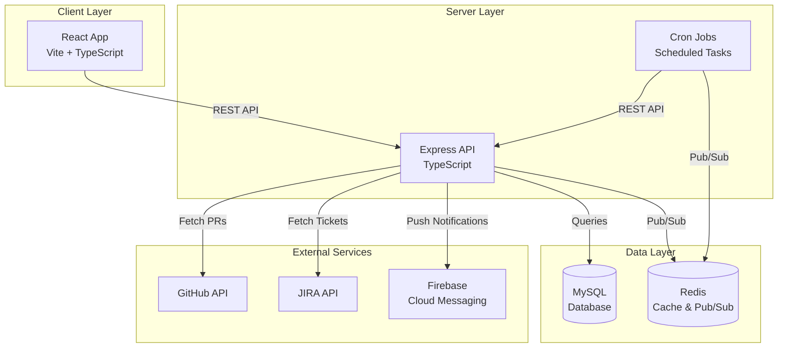
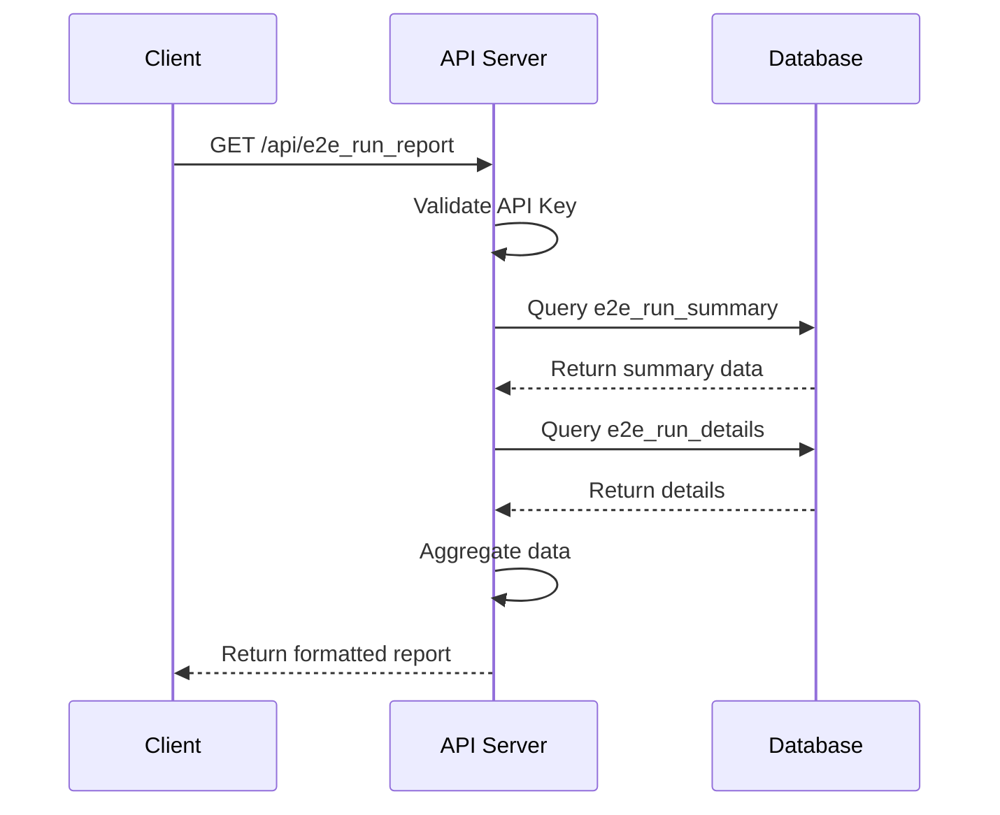
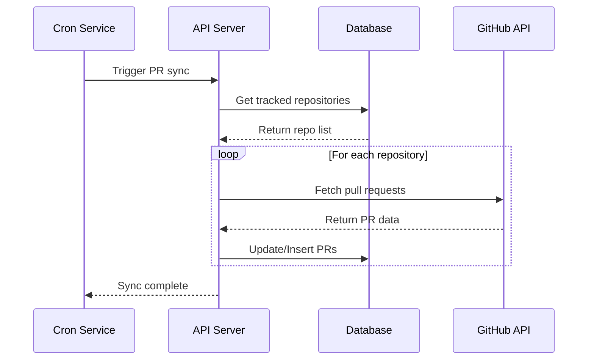
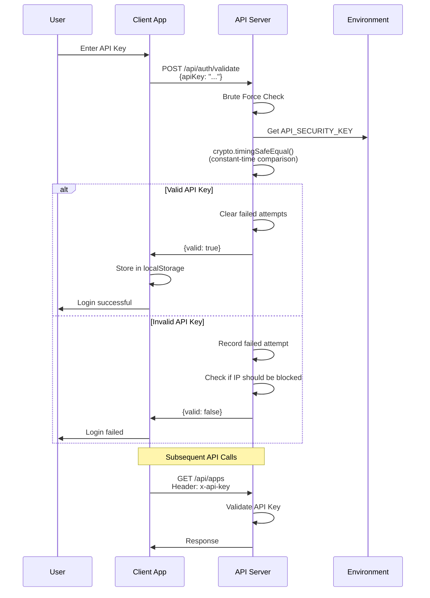
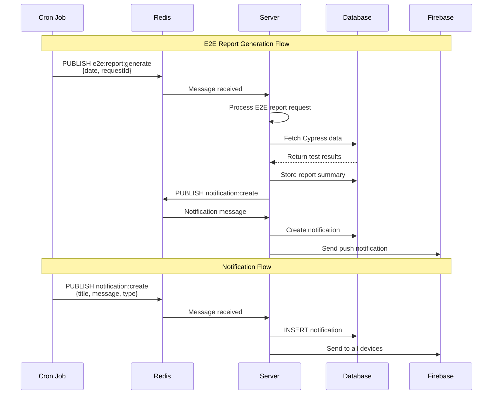
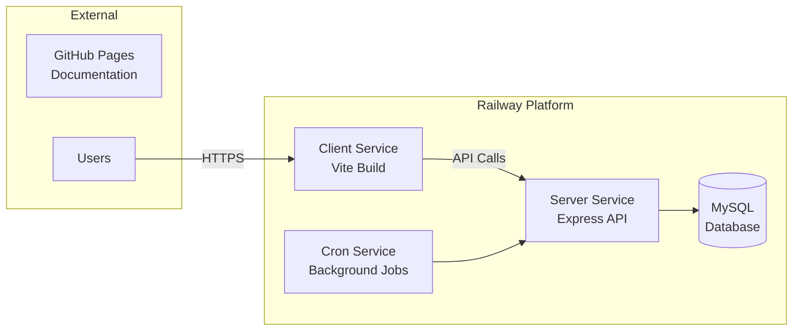

# Architecture Overview

My Dashboard is a full-stack TypeScript application built as a monorepo, designed to aggregate and visualize Cypress E2E test results with JIRA integration.

## System Architecture

### High-Level Architecture



## Technology Stack

### Frontend
- **Framework**: React 19
- **Build Tool**: Vite
- **Language**: TypeScript
- **UI Library**: Material-UI (MUI)
- **State Management**: React Context + Hooks
- **Routing**: React Router DOM
- **HTTP Client**: Fetch API

### Backend
- **Framework**: Express.js
- **Language**: TypeScript
- **Database**: MySQL 8.0
- **Database Client**: mysql2 (raw SQL queries)
- **Cache & Pub/Sub**: Redis (ioredis)
- **Validation**: Custom validation utilities
- **Authentication**: API Key (via x-api-key header)
- **Security**: Helmet.js, CORS, Rate Limiting, Brute Force Protection
- **Logging**: Custom logger utility

### Scheduled Jobs
- **Scheduler**: node-cron
- **Jobs**: E2E reports, PR management, manual testing reminders, cleanup tasks
- **Communication**: Redis Pub/Sub for async messaging

### Infrastructure
- **Package Manager**: pnpm with workspaces
- **Hosting**: Railway
- **CI/CD**: GitHub Actions
- **Documentation**: Docusaurus (GitHub Pages)

## Key Components

### 1. Client Application (`/client`)

Single-page React application that provides:
- E2E test results visualization
- Pull request monitoring
- JIRA ticket management
- Task management (to-do list)
- Real-time notifications

**Key Features:**
- Responsive Material-UI design
- Real-time data updates
- Push notifications via FCM
- API key authentication

### 2. API Server (`/server`)

RESTful API server that handles:
- Authentication and authorization
- Data management (CRUD operations)
- External service integrations
- Push notifications
- File system operations

**Key Features:**
- API key authentication
- Rate limiting and brute force protection
- Custom validation utilities
- Error handling middleware
- Security headers (Helmet.js)

### 3. Cron Service (`/cron`)

Background job processor for scheduled tasks:

**Scheduled Jobs:**
- **E2E Report Generation** (Daily at 9 AM): Publishes E2E report requests via Redis
- **Pull Requests Management** (Weekdays at 9 AM): Checks PR status, sends reminders, cleans up merged PRs
- **Manual Testing Reminders** (Weekdays at 9 AM): Checks JIRA for manual QA tickets
- **Delete Completed Todos** (Sundays at 2 AM): Cleans up completed to-do items

**Communication:**
- Uses Redis Pub/Sub for async messaging with the server
- Calls API endpoints via the TypeScript SDK
- Publishes notifications through Redis channels

### 4. Shared Packages (`/packages`)

#### `@my-dashboard/sdk`
TypeScript SDK for interacting with the API:
- Type-safe API client
- Service-based architecture
- Retry logic and error handling
- Comprehensive type definitions

#### `@my-dashboard/types`
Shared TypeScript type definitions:
- API request/response types
- Database model types
- Configuration types
- Shared interfaces

## Data Flow

### E2E Report Retrieval Flow



### Pull Request Sync Flow



### Authentication Flow



### Redis Pub/Sub Flow



## Redis Architecture

### Purpose
Redis is used for:
1. **Pub/Sub Messaging**: Async communication between cron jobs and server
2. **Future Use**: Caching, session storage, rate limiting

### Channels

| Channel               | Publisher | Subscriber | Purpose                                   |
|-----------------------|-----------|------------|-------------------------------------------|
| `e2e:report:generate` | Cron      | Server     | Trigger E2E report generation             |
| `notification:create` | Cron      | Server     | Create notifications from background jobs |

### Configuration
- **Client**: ioredis library
- **Connection**: Singleton pattern with separate client and subscriber instances
- **URL**: Configurable via `REDIS_URL` environment variable
- **Default**: `redis://localhost:6379`
- **Retry Strategy**: Exponential backoff (max 3 retries)

### Connection Management
```typescript
// Two separate connections
getRedisClient()      // For general operations (publish, get, set)
getRedisSubscriber()  // For pub/sub subscriptions only
```

## Cron Jobs Architecture

### Job Scheduler
- **Library**: node-cron
- **Configuration**: Cron expressions in `cron/config/default.js`
- **Environment Override**: Can override schedules via environment variables

### Scheduled Jobs

#### 1. E2E Report Generation
- **Schedule**: `0 9 * * *` (Daily at 9 AM)
- **Environment Variable**: `E2E_REPORT_CRON_SCHEDULE`
- **Function**: Publishes E2E report request to Redis
- **Flow**: Cron → Redis → Server → Database → Notifications

#### 2. Pull Requests Management
- **Schedule**: `0 9 * * 1-5` (Weekdays at 9 AM)
- **Environment Variable**: `PR_MANAGEMENT_SCHEDULE`
- **Functions**:
  - Check for approved PRs ready to merge
  - Send reminders for old PRs
  - Delete merged PRs from database
- **Flow**: Cron → API (via SDK) → Notifications (via Redis)

#### 3. Manual Testing Reminders
- **Schedule**: `0 9 * * 1-5` (Weekdays at 9 AM)
- **Environment Variable**: `MANUAL_TICKETS_REMINDER_SCHEDULE`
- **Function**: Checks JIRA for manual QA tickets and sends reminders
- **Flow**: Cron → JIRA API → Redis (notification) → Server

#### 4. Delete Completed Todos
- **Schedule**: `0 2 * * 0` (Sundays at 2 AM)
- **Environment Variable**: `DELETE_COMPLETED_TODOS_SCHEDULE`
- **Function**: Removes completed to-do items from database
- **Flow**: Cron → API (via SDK) → Database

### Cron Expression Format
```
┌───────────── minute (0 - 59)
│ ┌───────────── hour (0 - 23)
│ │ ┌───────────── day of month (1 - 31)
│ │ │ ┌───────────── month (1 - 12)
│ │ │ │ ┌───────────── day of week (0 - 6) (Sunday to Saturday)
│ │ │ │ │
* * * * *
```

Examples:
- `0 9 * * *` - Every day at 9:00 AM
- `0 9 * * 1-5` - Weekdays at 9:00 AM
- `*/15 * * * *` - Every 15 minutes
- `0 2 * * 0` - Sundays at 2:00 AM

## Security Architecture

### Authentication
- **API Key Only** (no JWT)
- Constant-time comparison to prevent timing attacks
- Environment-based configuration
- Header-based authentication (`x-api-key`)

### Brute Force Protection
- Rate limiting (configurable via env vars)
- Progressive slowdown in production
- IP-based blocking (30 min block after 3 failed attempts)
- In-memory tracking of failed attempts

### Security Headers
- Helmet.js for standard security headers
- Content Security Policy (CSP)
- HSTS (HTTP Strict Transport Security)
- X-Frame-Options, X-XSS-Protection

### Input Validation
- Custom validation utilities
- Input sanitization
- SQL injection prevention (parameterized queries)
- JSON payload size limits (10mb)

## Deployment Architecture

### Production Environment



### Deployment Strategy
- **Auto-deploy**: Triggered on push to `main` branch
- **Health Checks**: `/health` endpoint monitoring
- **Pre-deploy**: Database migrations run automatically
- **Environment Variables**: Managed via Railway dashboard

## Design Principles

### 1. Monorepo Structure
- Shared code via workspace packages
- Consistent tooling across projects
- Simplified dependency management
- Atomic commits across services

### 2. Type Safety
- TypeScript throughout the stack
- Shared type definitions
- Compile-time error detection
- Better IDE support

### 3. API-First Design
- RESTful API conventions
- OpenAPI specification
- Versioned endpoints
- Consistent error responses

### 4. Security by Default
- API key authentication
- Rate limiting
- Input validation
- Security headers

### 5. Developer Experience
- Hot module replacement (HMR)
- Fast build times with Vite
- Comprehensive error messages
- Extensive documentation

## Performance Considerations

### Frontend
- Code splitting with React Router
- Lazy loading of components
- Optimized bundle size
- Efficient re-rendering with React hooks

### Backend
- Database connection pooling
- Efficient SQL queries
- Response caching where appropriate
- Pagination for large datasets

### Database
- Indexed columns for frequent queries
- Normalized schema design
- Migration-based schema management
- Regular backups

## Scalability

### Horizontal Scaling
- Stateless API design
- Session data in database
- Load balancer ready

### Vertical Scaling
- Efficient resource usage
- Database query optimization
- Connection pooling

## Monitoring and Observability

### Logging
- Structured logging with custom Logger utility
- Different log levels (info, warn, error, debug)
- Request/response logging
- Error tracking

### Health Checks
- `/health` endpoint for service monitoring
- Database connection verification
- External service status checks

## Next Steps

- [Monorepo Structure](./monorepo-structure.md) - Detailed workspace organization
- [Client Architecture](./client-architecture.md) - Frontend architecture details
- [Server Architecture](./server-architecture.md) - Backend architecture details
- [Database Schema](./database-schema.md) - Database design and schema
- [Deployment](./deployment.md) - Deployment process and configuration
- [Security](./security.md) - Security implementation details

