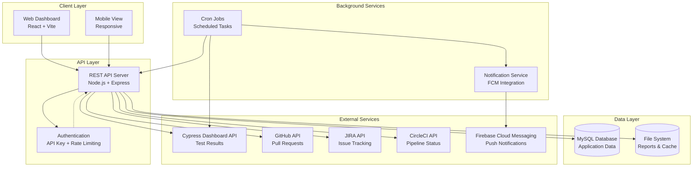
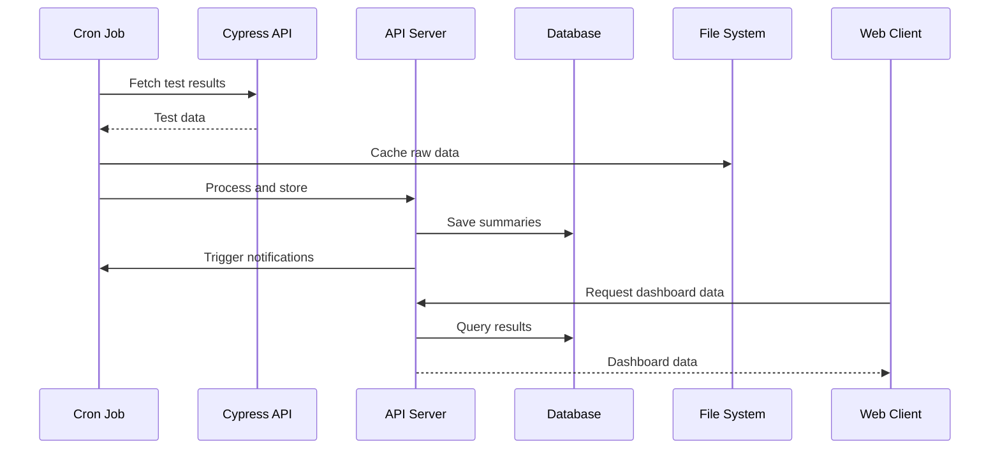
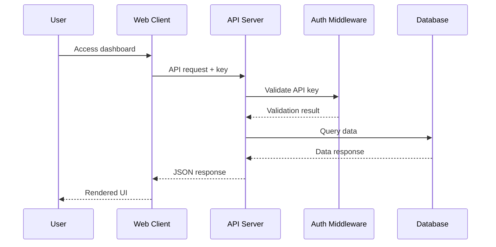
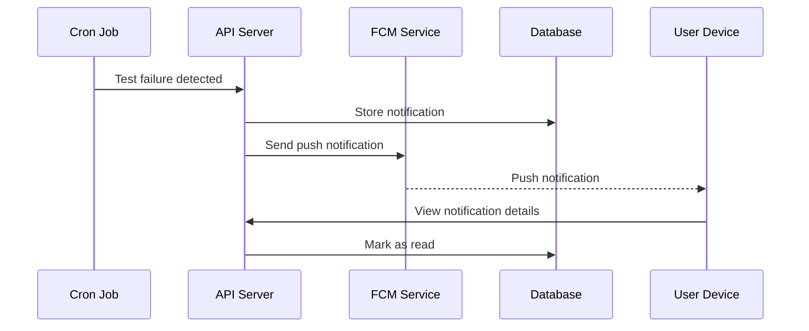

# System Architecture

My Dashboard is a comprehensive monorepo application designed for monitoring Cypress test results with automated git hooks for code quality. The system follows a microservices-inspired architecture with clear separation of concerns.

## High-Level Architecture



## Component Overview

### 🌐 Client Layer

**React Frontend (`client/`)**
- **Technology**: React 19, TypeScript, Vite
- **Purpose**: User interface for viewing test results, managing applications, and system administration
- **Features**:
  - Responsive design for desktop and mobile
  - Real-time dashboard updates
  - Authentication with API key management
  - Interactive charts and data visualization
  - Pull request management interface

### 🔧 API Layer

**REST API Server (`server/`)**
- **Technology**: Node.js, Express, TypeScript
- **Purpose**: Core business logic and data management
- **Architecture**: Layered architecture with controllers, services, and data access layers

**Key Components**:
- **Controllers**: Handle HTTP requests and responses
- **Services**: Business logic and external API integration
- **Middleware**: Authentication, rate limiting, error handling
- **Database**: MySQL for application data storage

### ⏰ Background Services

**Cron Jobs (`cron/`)**
- **Technology**: Node.js, TypeScript
- **Purpose**: Scheduled background tasks and data synchronization
- **Functions**:
  - Fetch E2E test results from Cypress Dashboard
  - Generate daily reports and summaries
  - Send notifications for failed tests
  - Clean up old data and cache files

### 🛠️ Utility Layer

**Scripts (`scripts/`)**
- **Purpose**: Development tools, CI/CD utilities, and maintenance scripts
- **Components**:
  - Code quality checks (TODO/FIXME detection)
  - Git hooks and commit validation
  - Deployment and backup scripts
  - E2E test execution helpers

## Data Flow

### 1. Test Result Processing



### 2. User Interaction Flow



### 3. Notification Flow



## Technology Stack

### Frontend
- **React 19**: Modern React with concurrent features
- **TypeScript**: Type safety and developer experience
- **Vite**: Fast build tool and development server
- **SWR**: Data fetching and caching
- **Material-UI**: Component library and design system

### Backend
- **Node.js**: JavaScript runtime
- **Express**: Web application framework
- **TypeScript**: Type safety for server-side code
- **MySQL**: Relational database
- **JWT**: Token-based authentication (where applicable)

### DevOps & Tools
- **ESLint**: Code linting and quality checks
- **Prettier**: Code formatting
- **Husky**: Git hooks for code quality
- **Jest**: Unit testing framework
- **Playwright**: End-to-end testing
- **GitHub Actions**: CI/CD pipeline

### External Integrations
- **Cypress Dashboard API**: Test result data
- **GitHub API**: Pull request information
- **JIRA API**: Issue tracking integration
- **CircleCI API**: Pipeline status monitoring
- **Firebase Cloud Messaging**: Push notifications

## Security Architecture

### Authentication & Authorization
- **API Key Authentication**: Secure access to API endpoints
- **Rate Limiting**: Protection against abuse and DoS attacks
- **Brute Force Protection**: Progressive delays and IP blocking
- **Input Validation**: Comprehensive request validation
- **CORS Configuration**: Controlled cross-origin access

### Data Protection
- **Path Traversal Protection**: Secure file system access
- **Protected Files**: Critical files cannot be deleted
- **Environment Variables**: Secure configuration management
- **Audit Logging**: Request and error logging

## Scalability Considerations

### Current Architecture
- **Monorepo Structure**: Simplified development and deployment
- **File-based Caching**: Simple and effective for current scale
- **Single Server Deployment**: Cost-effective and maintainable

### Future Scaling Options
- **Caching Layer**: Redis for improved performance
- **Load Balancing**: Multiple server instances
- **Microservices**: Split components for independent scaling
- **Container Deployment**: Docker and Kubernetes support

## Deployment Architecture

### Development Environment
```
localhost:3000  → API Server
localhost:5173  → React Development Server
```

### Production Environment
```
Domain/API      → API Server (Node.js)
Domain/         → Static React Build
Background      → Cron Jobs (Scheduled)
```

## Monitoring & Observability

### Health Monitoring
- **Health Check Endpoint**: `/health` for service status
- **Error Logging**: Comprehensive error tracking
- **Performance Metrics**: Response time monitoring
- **Resource Usage**: Memory and CPU monitoring

### Business Metrics
- **Test Success Rates**: E2E test performance tracking
- **API Usage**: Endpoint usage statistics
- **User Activity**: Dashboard usage patterns
- **System Alerts**: Automated failure notifications

## Development Workflow

### Code Quality Pipeline
1. **Pre-commit Hooks**: Linting, formatting, and validation
2. **Automated Testing**: Unit and integration tests
3. **E2E Testing**: Full application testing
4. **Code Review**: Pull request review process
5. **Deployment**: Automated deployment pipeline

### Data Flow Testing
- **Unit Tests**: Individual component testing
- **Integration Tests**: API endpoint testing
- **E2E Tests**: Full user journey testing
- **Performance Tests**: Load and stress testing

This architecture provides a solid foundation for the current requirements while maintaining flexibility for future growth and enhancements.
