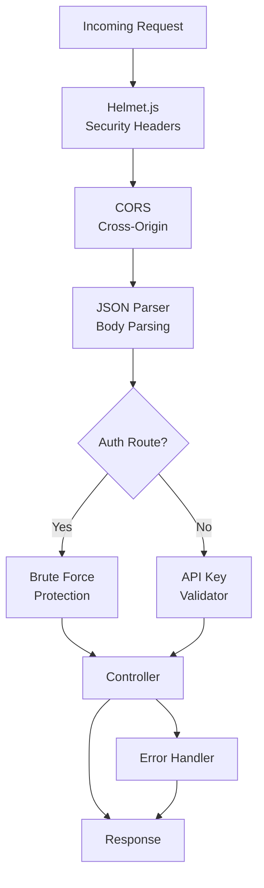

# Server Architecture

The server application is a robust Node.js backend built with Express.js and TypeScript, providing RESTful APIs for the My Dashboard application. It handles authentication, data management, integrations with external services (GitHub, JIRA, Firebase), and real-time notifications.

## Technology Stack

### Core Technologies
- **Node.js v22.19.0** - JavaScript runtime environment
- **Express.js 5.1.0** - Web application framework
- **TypeScript 5.3.3** - Type-safe JavaScript development
- **MySQL2 3.14.5** - Database connectivity
- **Redis (ioredis)** - Caching and Pub/Sub messaging

### Key Libraries
- **Helmet.js** - Security headers
- **CORS** - Cross-origin resource sharing
- **dotenv** - Environment variable management
- **firebase-admin** - Firebase Cloud Messaging
- **Octokit** - GitHub API client
- **node-cron** - Scheduled tasks (in cron service)

## Project Structure

```
server/
├── src/
│   ├── config/            # Configuration files
│   │   └── firebase-config.ts
│   ├── controllers/       # Request handlers
│   │   ├── app.controller.ts
│   │   ├── auth.controller.ts
│   │   ├── e2e_report_controller.ts
│   │   ├── fcm.controller.ts
│   │   ├── jira_controller.ts
│   │   ├── notification.controller.ts
│   │   ├── pull_request.controller.ts
│   │   └── to_do_list.controller.ts
│   ├── db/                # Database configuration
│   │   ├── database.ts    # Database abstraction layer
│   │   ├── migrate.ts     # Migration runner
│   │   └── mysql.ts       # MySQL connection pool
│   ├── middleware/        # Express middleware
│   │   ├── api_key_validator.ts
│   │   ├── bruteForceProtection.ts
│   │   └── error_handler.ts
│   ├── routes/            # API route definitions
│   │   ├── apps.ts
│   │   ├── auth.ts
│   │   ├── e2e_manual_runs.ts
│   │   ├── e2e_run_report.ts
│   │   ├── fcm.ts
│   │   ├── jira.ts
│   │   ├── notifications.ts
│   │   ├── pull_requests.ts
│   │   └── to_do_list.ts
│   ├── processors/        # Background processors
│   │   ├── start-processor.ts
│   │   ├── e2e-report-processor.ts
│   │   └── notification-processor.ts
│   ├── services/          # Business logic services
│   │   ├── github.service.ts
│   │   ├── jira.service.ts
│   │   └── fcm.service.ts
│   ├── utils/             # Utility functions
│   │   ├── logger.ts
│   │   └── validation.ts
│   ├── errors/            # Custom error classes
│   │   └── AppError.ts
│   └── index.ts           # Application entry point
├── migrations/            # Database migrations
│   └── mysql/             # MySQL migration files
├── docs/                  # API documentation
│   └── api-documentation/ # OpenAPI specs
├── .env.example           # Environment variables template
├── package.json           # Dependencies and scripts
└── tsconfig.json          # TypeScript configuration
```

## Application Architecture

### Entry Point

The application starts in `index.ts`, which:
1. Loads environment variables
2. Configures Express middleware
3. Sets up routes
4. Starts background processors
5. Handles errors
6. Starts the HTTP server

```typescript
// index.ts
const app = express();
const PORT = process.env.PORT || 3000;

// Middleware
app.use(helmet({ /* security config */ }));
app.use(cors({ origin: '*' }));
app.use(express.json({ limit: '10mb' }));

// Routes
app.use('/api/auth', createAuthRouter());
app.use('/api', apiKeyValidator); // Protect all other routes
app.use('/api/e2e_run_report', createE2ERunReportRouter());
// ... other routes

// Start server
app.listen(PORT);
```

### Middleware Stack



### Security Middleware

#### 1. Helmet.js
Adds security headers to all responses:
- Content Security Policy (CSP)
- HTTP Strict Transport Security (HSTS)
- X-Frame-Options
- X-XSS-Protection
- X-Content-Type-Options

```typescript
app.use(helmet({
  contentSecurityPolicy: {
    directives: {
      defaultSrc: ["'self'"],
      styleSrc: ["'self'", "'unsafe-inline'"],
      scriptSrc: ["'self'"],
      imgSrc: ["'self'", 'data:', 'https:'],
    },
  },
  hsts: {
    maxAge: 31536000,
    includeSubDomains: true,
    preload: true,
  },
}));
```

#### 2. API Key Validator
Validates API key for all protected routes:

```typescript
const apiKeyValidator = (req, res, next) => {
  const apiKey = req.header('x-api-key');
  const validApiKey = process.env.API_SECURITY_KEY;

  if (!apiKey || apiKey !== validApiKey) {
    return next(new UnauthorizedError('Invalid or missing API key'));
  }

  next();
};
```

#### 3. Brute Force Protection
Protects authentication endpoints from brute force attacks:
- Rate limiting (configurable)
- Progressive slowdown in production
- IP-based blocking (30 min after 3 failed attempts)
- In-memory tracking of failed attempts

```typescript
class BruteForceProtection {
  private failedAttempts: Map<string, FailedAttempt>;
  private maxAttempts = 3;
  private windowMs = 15 * 60 * 1000; // 15 minutes
  private blockDurationMs = 30 * 60 * 1000; // 30 minutes

  checkBlocked(req, res, next) {
    const ip = this.getClientIP(req);
    const attempt = this.failedAttempts.get(ip);

    if (attempt?.blockedUntil && new Date() < attempt.blockedUntil) {
      return res.status(429).json({ error: 'Too many failed attempts' });
    }

    next();
  }
}
```

### Database Layer

#### Connection Pool

MySQL connection pool for efficient database access:

```typescript
export function getMySQLPool(): mysql.Pool {
  if (!pool) {
    const config: mysql.PoolOptions = {
      host: process.env.MYSQL_HOST || 'localhost',
      port: parseInt(process.env.MYSQL_PORT || '3306'),
      user: process.env.MYSQL_USER || 'root',
      password: process.env.MYSQL_PASSWORD || '',
      database: process.env.MYSQL_DATABASE || 'my_dashboard',
      charset: 'utf8mb4',
      timezone: '+00:00',
      connectionLimit: parseInt(process.env.MYSQL_CONNECTION_LIMIT || '10'),
      waitForConnections: true,
      queueLimit: 0,
      enableKeepAlive: true,
    };

    pool = mysql.createPool(config);
  }

  return pool;
}
```

#### Database Manager

Abstraction layer for database operations:

```typescript
export class DatabaseManager {
  // Execute query and return all results
  async all(sql: string, params: any[]): Promise<DatabaseRow[]>

  // Execute query and return first result
  async get(sql: string, params: any[]): Promise<DatabaseRow | undefined>

  // Execute INSERT/UPDATE/DELETE
  async run(sql: string, params: any[]): Promise<DatabaseResult>

  // Execute multiple statements (migrations)
  async exec(sql: string): Promise<void>

  // Transaction support
  async beginTransaction(): Promise<void>
  async commit(): Promise<void>
  async rollback(): Promise<void>
}
```

### Route Structure

#### Authentication Routes (`/api/auth`)
- `POST /validate` - Validate API key

#### E2E Report Routes (`/api/e2e_run_report`)
- `GET /` - Get all E2E reports
- `GET /:date` - Get report for specific date
- `POST /` - Create new report

#### Application Routes (`/api/apps`)
- `GET /` - Get all applications
- `GET /:id` - Get application by ID
- `POST /` - Create new application
- `PUT /:id` - Update application
- `DELETE /:id` - Delete application

#### Pull Request Routes (`/api/pull_requests`)
- `GET /` - Get all pull requests
- `GET /:id` - Get pull request by ID
- `POST /` - Create new pull request
- `PUT /:id` - Update pull request
- `DELETE /:id` - Delete pull request

#### Notification Routes (`/api/notifications`)
- `GET /` - Get all notifications
- `POST /` - Create notification
- `PUT /:id/read` - Mark as read
- `DELETE /:id` - Delete notification

#### JIRA Routes (`/api/jira`)
- `GET /tickets` - Get JIRA tickets
- `GET /tickets/:key` - Get specific ticket

#### To-Do List Routes (`/api/to_do_list`)
- `GET /` - Get all todos
- `POST /` - Create todo
- `PUT /:id` - Update todo
- `DELETE /:id` - Delete todo

#### FCM Routes (`/api/fcm`)
- `POST /register` - Register device token
- `POST /send` - Send push notification

### Controller Pattern

Controllers handle HTTP requests and responses:

```typescript
export class E2EReportController {
  async getReports(req: Request, res: Response, next: NextFunction) {
    try {
      const reports = await this.e2eReportService.getAllReports();
      res.json({ success: true, data: reports });
    } catch (error) {
      next(error);
    }
  }

  async getReportByDate(req: Request, res: Response, next: NextFunction) {
    try {
      const { date } = req.params;
      const report = await this.e2eReportService.getReportByDate(date);
      
      if (!report) {
        throw new NotFoundError('Report', date);
      }

      res.json({ success: true, data: report });
    } catch (error) {
      next(error);
    }
  }
}
```

### Error Handling

Centralized error handling middleware:

```typescript
export const errorHandler = (
  err: Error,
  req: Request,
  res: Response,
  next: NextFunction
) => {
  Logger.error('Error occurred:', { error: err });

  if (err instanceof AppError) {
    return res.status(err.statusCode).json({
      success: false,
      error: err.message,
      code: err.code,
    });
  }

  // Default error response
  res.status(500).json({
    success: false,
    error: 'Internal server error',
  });
};
```

Custom error classes:
- `AppError` - Base error class
- `NotFoundError` - 404 errors
- `UnauthorizedError` - 401 errors
- `ValidationError` - 400 errors
- `ConflictError` - 409 errors

### External Service Integration

#### GitHub Service
```typescript
export class GitHubService {
  private octokit: Octokit;

  async getPullRequests(owner: string, repo: string) {
    const { data } = await this.octokit.pulls.list({
      owner,
      repo,
      state: 'open',
    });
    return data;
  }
}
```

#### JIRA Service
```typescript
export class JiraService {
  async getTickets(jql: string) {
    const response = await fetch(
      `${this.baseUrl}/rest/api/3/search?jql=${encodeURIComponent(jql)}`,
      {
        headers: {
          'Authorization': `Basic ${this.authToken}`,
          'Content-Type': 'application/json',
        },
      }
    );
    return response.json();
  }
}
```

#### Firebase Cloud Messaging
```typescript
export class FCMService {
  async sendNotification(tokens: string[], message: FCMMessage) {
    const payload = {
      notification: {
        title: message.title,
        body: message.body,
      },
      data: message.data,
    };

    await admin.messaging().sendMulticast({
      tokens,
      ...payload,
    });
  }
}
```

### Redis Pub/Sub Architecture

Redis is used for asynchronous communication between services:

#### Channels
- `e2e:report:generate` - Trigger E2E report generation
- `notification:create` - Create notifications from background jobs
- `pr:delete` - Delete pull request

#### Publisher (Cron Service)
```typescript
await redisClient.publish('e2e:report:generate', JSON.stringify({
  date: '2024-01-20',
  requestId: 'uuid',
}));
```

#### Subscriber (Server)
```typescript
redisSubscriber.subscribe('e2e:report:generate');

redisSubscriber.on('message', async (channel, message) => {
  if (channel === 'e2e:report:generate') {
    const data = JSON.parse(message);
    await processE2EReport(data);
  }
});
```

### Background Processors

Processors handle asynchronous tasks triggered via Redis:

#### E2E Report Processor
- Listens to `e2e:report:generate` channel
- Fetches Cypress test data
- Generates report summary
- Stores in database
- Sends notifications

#### Notification Processor
- Listens to `notification:create` channel
- Creates notification in database
- Sends push notification via FCM

### Health Check

Health check endpoint for monitoring:

```typescript
app.get('/health', async (req, res) => {
  const dbConnected = await testMySQLConnection();

  res.status(200).json({
    success: true,
    status: dbConnected ? 'ok' : 'degraded',
    service: 'My Dashboard Server',
    dbConnected,
    timestamp: new Date().toISOString(),
    uptime: process.uptime(),
    environment: process.env.NODE_ENV || 'development',
  });
});
```

## Next Steps

- [Database Schema](./database-schema.md) - Database design and schema
- [Deployment](./deployment.md) - Deployment process
- [Security](./security.md) - Security implementation details
- [API Documentation](../api/overview.md) - API reference

