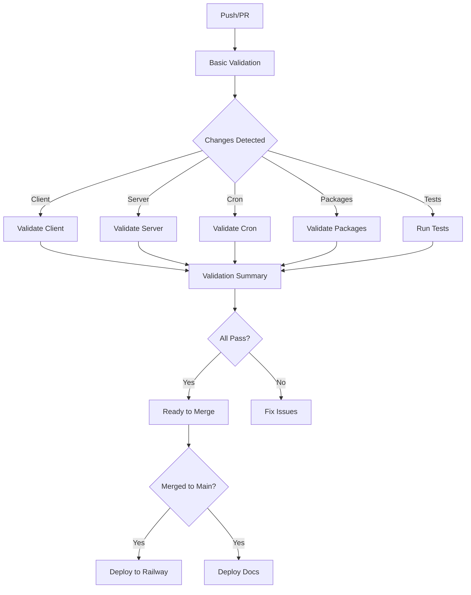

# CI/CD

This document describes the Continuous Integration and Continuous Deployment (CI/CD) pipeline used in the My Dashboard project.

## Overview

The project uses **GitHub Actions** for CI/CD automation. The pipeline ensures code quality, runs tests, and deploys to production automatically.

## Pipeline Architecture



## Workflows

### 1. PR Validation (`pr-validation.yml`)

**Trigger:** Pull requests to `main` or `develop`

**Jobs:**
1. **Basic Validation** - Validates commits, PR title, detects changes
2. **Client Validation** - Runs when client files change
3. **Server Validation** - Runs when server files change
4. **Cron Validation** - Runs when cron files change
5. **Packages Validation** - Runs when package files change
6. **Tests Validation** - Runs integration and E2E tests
7. **Validation Summary** - Aggregates results

**Example:**
```yaml
name: PR Validation

on:
  pull_request:
    types: [opened, synchronize, reopened, ready_for_review]
    branches:
      - main
      - develop

jobs:
  basic-validation:
    if: github.event.pull_request.draft == false
    uses: ./.github/workflows/basic-validation.yml
    with:
      pr-title: ${{ github.event.pull_request.title }}
      base-sha: ${{ github.event.pull_request.base.sha }}
      head-sha: ${{ github.event.pull_request.head.sha }}
      pr-number: ${{ github.event.pull_request.number }}
```

### 2. Basic Validation (`basic-validation.yml`)

**Purpose:** Validate commits, PR title, and detect file changes

**Steps:**
1. **Validate Commits** - Check conventional commit format
2. **Validate PR Title** - Check conventional commit format
3. **Detect Changes** - Determine which files changed
4. **Check TODOs** - Find TODO/FIXME comments

**Change Detection:**
```yaml
- name: Detect changes
  uses: dorny/paths-filter@v3
  with:
    filters: |
      client:
        - 'client/**'
      server:
        - 'server/**'
      cron:
        - 'cron/**'
      packages-sdk:
        - 'packages/sdk/**'
      packages-types:
        - 'packages/types/**'
```

### 3. Client Validation (`validate-client.yml`)

**Trigger:** When client files change

**Steps:**
1. **Setup** - Checkout code, setup Node.js
2. **Build Dependencies** - Build types and SDK packages
3. **Lint** - Run ESLint
4. **Type Check** - Run TypeScript compiler
5. **Build** - Build client for production
6. **Test** - Run unit tests

**Example:**
```yaml
- name: Run ESLint
  run: pnpm --filter=client run lint

- name: Type check
  run: pnpm --filter=client run typecheck

- name: Build client
  run: pnpm --filter=client run build

- name: Run unit tests
  run: pnpm --filter=client run test
```

### 4. Server Validation (`validate-server.yml`)

**Trigger:** When server files change

**Services:**
- MySQL 8.0 (for testing)

**Steps:**
1. **Setup** - Checkout code, setup Node.js, start MySQL
2. **Build Dependencies** - Build types package
3. **Lint** - Run ESLint
4. **Type Check** - Run TypeScript compiler
5. **Build** - Build server
6. **Migrate** - Test database migrations
7. **Test** - Run unit tests

**Example:**
```yaml
services:
  mysql:
    image: mysql:8.0
    env:
      MYSQL_ROOT_PASSWORD: test_password
      MYSQL_DATABASE: test_db
    ports:
      - 3306:3306

steps:
  - name: Test database migrations
    env:
      MYSQL_HOST: localhost
      MYSQL_PORT: 3306
      MYSQL_USER: root
      MYSQL_PASSWORD: test_password
      MYSQL_DATABASE: test_db
    run: pnpm --filter=server run migrate

  - name: Run unit tests
    run: pnpm --filter=server run test
```

### 5. Cron Validation (`validate-cron.yml`)

**Trigger:** When cron files change

**Steps:**
1. **Setup** - Checkout code, setup Node.js
2. **Build Dependencies** - Build types and SDK packages
3. **Type Check** - Run TypeScript compiler
4. **Lint** - Run ESLint
5. **Build** - Build cron jobs
6. **Test** - Run unit tests

### 6. Integration Tests (`run-integration-tests.yml`)

**Trigger:** When integration test files change or manually

**Services:**
- MySQL 8.0
- Redis

**Steps:**
1. **Setup** - Checkout code, setup Node.js
2. **Start Services** - MySQL, Redis
3. **Build Dependencies** - Build all required packages
4. **Start Server** - Run server in background
5. **Run Tests** - Execute integration tests
6. **Upload Results** - Save test results on failure

**Example:**
```yaml
- name: Run integration tests
  run: |
    cat > .env << EOF
    NODE_ENV=test
    SERVER_URL=http://localhost:3000
    API_SECURITY_KEY=${{ secrets.API_SECURITY_KEY }}
    MYSQL_HOST=localhost
    MYSQL_PORT=3306
    EOF
    
    npm test -- --bail
```

### 7. E2E Tests (`validate-tests-e2e.yml`)

**Trigger:** When E2E test files change or manually

**Steps:**
1. **Setup** - Checkout code, setup Node.js
2. **Install Dependencies** - Install E2E test dependencies
3. **Lint** - Run ESLint
4. **Type Check** - Run TypeScript compiler

**Note:** Full E2E tests run separately with browser automation

### 8. Documentation Deployment (`deploy-project-documentation.yml`)

**Trigger:** Push to `main` branch

**Steps:**
1. **Setup** - Checkout code, setup Node.js
2. **Install** - Install documentation dependencies
3. **Build** - Build Docusaurus site
4. **Upload** - Upload build artifact
5. **Deploy** - Deploy to GitHub Pages

**Example:**
```yaml
- name: Build documentation
  run: npm run build
  working-directory: ./docs

- name: Deploy to GitHub Pages
  uses: actions/deploy-pages@v4
```

## Environment Variables

### Client

```env
VITE_API_BASE_URL=https://api.mydashboard.com
VITE_FIREBASE_API_KEY=...
VITE_FIREBASE_PROJECT_ID=...
VITE_FIREBASE_MESSAGING_SENDER_ID=...
VITE_FIREBASE_APP_ID=...
```

### Server

```env
NODE_ENV=production
PORT=3000
API_SECURITY_KEY=...
MYSQL_HOST=...
MYSQL_PORT=3306
MYSQL_USER=...
MYSQL_PASSWORD=...
MYSQL_DATABASE=...
REDIS_URL=...
GITHUB_TOKEN=...
JIRA_API_TOKEN=...
FIREBASE_PROJECT_ID=...
```

### Cron

```env
NODE_ENV=production
API_URL=https://api.mydashboard.com
API_SECURITY_KEY=...
REDIS_URL=...
E2E_REPORT_CRON_SCHEDULE=0 9 * * *
CLEAN_UP_OLD_REPORTS_CRON_SCHEDULE=0 3 * * 0
```

## Secrets Management

Secrets are stored in GitHub Secrets and Railway environment variables.

**GitHub Secrets:**
- `API_SECURITY_KEY` - API authentication key
- `RAILWAY_TOKEN` - Railway deployment token (if needed)

**Railway Environment Variables:**
- All production environment variables
- Managed through Railway dashboard
- Separate variables per service

## Deployment Process

### Automatic Deployment

**Trigger:** Merge to `main` branch

**Flow:**
1. **GitHub Actions** - Run all validation workflows
2. **Railway Webhook** - Triggered on push to main
3. **Railway Build** - Build each service
4. **Railway Deploy** - Deploy services
5. **Health Checks** - Verify deployment

### Manual Deployment

**Railway Dashboard:**
1. Navigate to service
2. Click "Deploy"
3. Select commit or branch
4. Confirm deployment

**Railway CLI:**
```bash
# Install Railway CLI
npm install -g @railway/cli

# Login
railway login

# Link project
railway link

# Deploy
railway up
```

## Health Checks

### Server Health Check

```typescript
app.get('/health', (req, res) => {
  res.status(200).json({
    status: 'healthy',
    timestamp: new Date().toISOString(),
  });
});
```

**Railway Configuration:**
```json
{
  "healthcheck": {
    "path": "/health",
    "interval": 30,
    "timeout": 10
  }
}
```

### Client Health Check

Static files are served by Railway's CDN. Health is determined by successful HTTP responses.

## Rollback Procedures

### Railway Rollback

**Dashboard:**
1. Go to service deployments
2. Find previous successful deployment
3. Click "Redeploy"

**CLI:**
```bash
# List deployments
railway deployments

# Rollback to specific deployment
railway rollback <deployment-id>
```

### Git Rollback

```bash
# Revert last commit
git revert HEAD

# Push to main
git push origin main

# Railway will automatically deploy the reverted state
```

## Monitoring and Logs

### Railway Logs

**Dashboard:**
1. Navigate to service
2. Click "Logs" tab
3. Filter by service, time, level

**CLI:**
```bash
# View logs
railway logs

# Follow logs
railway logs --follow

# Filter by service
railway logs --service server
```

### GitHub Actions Logs

1. Go to repository
2. Click "Actions" tab
3. Select workflow run
4. View job logs

## Best Practices

### CI/CD

- **Fast Feedback** - Keep workflows fast (< 10 minutes)
- **Fail Fast** - Stop on first failure
- **Parallel Jobs** - Run independent jobs in parallel
- **Cache Dependencies** - Cache node_modules
- **Minimal Secrets** - Only store necessary secrets

### Testing in CI

- **Isolated Tests** - Tests should not depend on each other
- **Clean State** - Reset database/state between tests
- **Timeouts** - Set reasonable timeouts
- **Retry Logic** - Retry flaky tests (sparingly)

### Deployment

- **Zero Downtime** - Use health checks and rolling deployments
- **Database Migrations** - Run migrations before deployment
- **Environment Parity** - Keep dev/staging/prod similar
- **Rollback Plan** - Always have a rollback strategy

## Troubleshooting

### Workflow Failures

**Check Logs:**
```bash
# View workflow logs in GitHub Actions
# Look for error messages and stack traces
```

**Common Issues:**
- Dependency installation failures → Clear cache
- Test failures → Run tests locally
- Build failures → Check TypeScript errors
- Deployment failures → Check Railway logs

### Deployment Issues

**Railway Service Not Starting:**
1. Check environment variables
2. Check health check endpoint
3. Review build logs
4. Check resource limits

**Database Migration Failures:**
1. Check database connection
2. Review migration files
3. Check for conflicts
4. Rollback and retry

### Performance Issues

**Slow Workflows:**
- Enable caching
- Parallelize jobs
- Reduce test scope
- Optimize build process

**Slow Deployments:**
- Optimize Docker images
- Reduce build artifacts
- Use build caching
- Optimize dependencies

## Next Steps

- [Testing](./testing.md) - Testing guidelines
- [Deployment](../architecture/deployment.md) - Deployment architecture
- [Troubleshooting](./troubleshooting.md) - Common issues

