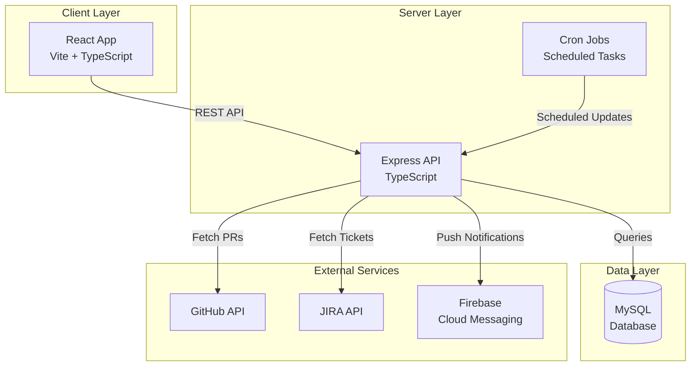

# My Dashboard Documentation

Welcome to the **My Dashboard** documentation! This is a comprehensive Cypress test results dashboard with JIRA integration, built as a full-stack TypeScript monorepo.

## 🎯 What is My Dashboard?

My Dashboard is a modern web application designed to aggregate, visualize, and manage Cypress E2E test results alongside development workflows. It provides:

- **Real-time E2E Test Monitoring** - Track Cypress test execution results across multiple applications
- **Pull Request Integration** - Monitor GitHub pull requests and their test status
- **JIRA Integration** - View and manage JIRA tickets directly from the dashboard
- **Task Management** - Built-in to-do list for tracking development tasks
- **Push Notifications** - Real-time alerts via Firebase Cloud Messaging
- **Application Monitoring** - Track multiple projects and their test health

## 🏗️ Architecture Overview

## 🚀 Technology Stack

### Frontend
- **React 19** - Modern React with latest features
- **Vite** - Fast build tool and development server
- **TypeScript** - Type-safe development
- **Material-UI (MUI)** - Component library
- **React Router** - Client-side routing

### Backend
- **Express.js** - Web application framework
- **TypeScript** - Type-safe server code
- **MySQL 8.0** - Relational database
- **mysql2** - Database client (raw SQL)

### Infrastructure
- **pnpm** - Fast, disk space efficient package manager
- **Railway** - Hosting and deployment
- **GitHub Actions** - CI/CD pipeline
- **Docusaurus** - Documentation site (this site!)

## 📚 Documentation Sections

### Getting Started
- [**Getting Started**](./getting-started.md) - Setup and installation guide

### Architecture
- [**Architecture Overview**](./architecture/overview.md) - System architecture and design
- [**Monorepo Structure**](./architecture/monorepo-structure.md) - Workspace organization
- [**Client Architecture**](./architecture/client-architecture.md) - Frontend architecture
- [**Server Architecture**](./architecture/server-architecture.md) - Backend architecture
- [**Database Schema**](./architecture/database-schema.md) - Database design
- [**Deployment**](./architecture/deployment.md) - Deployment architecture
- [**Security**](./architecture/security.md) - Security implementation

### Development
- [**Development Setup**](./development/setup.md) - Development environment
- [**Coding Standards**](./development/coding-standards.md) - Code style and conventions
- [**Git Workflow**](./development/git-workflow.md) - Branching and commits
- [**Testing**](./development/testing.md) - Testing guidelines
- [**CI/CD**](./development/ci-cd.md) - Continuous integration and deployment
- [**Contributing**](./development/contributing.md) - Contribution guidelines
- [**Troubleshooting**](./development/troubleshooting.md) - Common issues

### SDK
- [**SDK Overview**](./sdk/overview.md) - TypeScript SDK introduction
- [**Installation**](./sdk/installation.md) - How to install the SDK
- [**Authentication**](./sdk/authentication.md) - SDK authentication
- [**Usage Examples**](./sdk/usage-examples.md) - Code examples

### API Reference
- [**API Overview**](./api/overview.md) - API introduction
- [**Authentication**](./api/authentication.md) - API authentication
- [**Error Handling**](./api/error-handling.md) - Error codes and responses
- [**Endpoints**](./api/endpoints/e2e-reports.md) - API endpoint documentation

### Other Resources
- [**AI Agent Instructions**](./others/agents.md) - Guidelines for AI coding agents
- [**FAQ**](./others/faq.md) - Frequently asked questions
- [**Glossary**](./others/glossary.md) - Terms and definitions

## 🎓 Quick Links

- **GitHub Repository**: [jayc13/my-dashboard](https://github.com/jayc13/my-dashboard)
- **OpenAPI Specification**: [API Documentation](https://github.com/jayc13/my-dashboard/tree/main/server/docs/api-documentation)
- **Live Documentation**: [GitHub Pages](https://jayc13.github.io/my-dashboard/)

## 🤝 Contributing

We welcome contributions! Please read our [Contributing Guide](./development/contributing.md) to get started.

## 📝 License

This project is licensed under the terms specified in the LICENSE file.

---

**Need Help?** Check out our [FAQ](./others/faq.md) or [Troubleshooting Guide](./development/troubleshooting.md).

